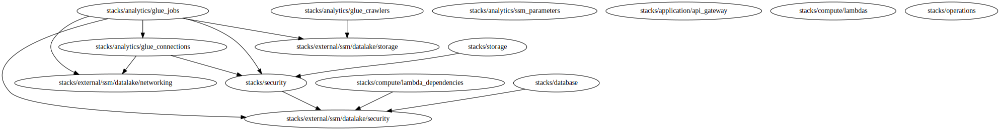

# IaC Datalake - NIIF17

## Descripción 

Este proyecto contiene codigo de IaC en lenguaje Terraform que permite la implementación de recursos asociados al dominio de datalake infraestructura para iniciativa de analitica. Dentro de los recursos definidos en este proyecto se tiene la siguiente distribución basado en capas:

...

### Requerimientos

Se debe contar con Parameter Store que contenga imformación de la capa de Networking
```
// Name: /datalake/<dev>/networking/parameters
// Description: Json string with the data of network components provisioned upon receiving the account
{
    "vpc_id": "",
    "public_azs": [],
    "public_subnet_ids": [],
    "public_route_table_ids": [],
    "private_azs": [],
    "private_subnet_ids": [],
    "private_route_table_ids": []
}
```

### Diagrama de dependencias

A continuación se presenta el diagrama de dependencias de los recursos creados en con este codigo.

<center>


##### **Diagrama de dependencias**

</center>

### Parametros Globales

Estos parámetros son definidos en el fichero 'path_project/common/common.hcl' y tiene la función de parametrizar las configuraciones del backend de Terraform, conteniendo información de recursos en AWS como Bucket y DynamoDB, profile de credenciales de AWS CLI usado para interactuar con estos recursos y estructura usada para la gestión de ficheros que son creados.

```hcl
locals {
  # Default values for variables
  provider = "aws"
  client   = "alfa-analitica"
  project  = "datalake"

  # Backend Configuration
  backend = {
    default = {
      region         = "us-east-1"
      profile        = "sh-datalake-dev"
      bucket         = "alfa-analitica-dev-terraform-storage"
      dynamodb_table = "alfa-analitica-dev-terraform-locks"
    }
    dev = {
      region         = "us-east-1"
      profile        = "sh-datalake-dev"
      bucket         = "alfa-analitica-dev-terraform-storage"
      dynamodb_table = "alfa-analitica-dev-terraform-locks"
    }
    qa = {
      region         = "us-east-1"
      profile        = "sh-datalake-qa"
      bucket         = "alfa-analitica-qa-terraform-storage"
      dynamodb_table = "alfa-analitica-qa-terraform-locks"
    }
  }
  backend_key     = "terraform.tfstate"
  backend_prefix  = "${local.prefix}/${local.project}"
  backend_encrypt = tru
}
```

### Entradas Globales

En este apartado se definen variables usadas como inputs globales disponibles para todos los recursos del proyecto, su definición se encuentra en el fichero 'path_project/common/common.hcl' dentro del bloque 'generate provider' en el atributo contens.

| Name | Description | Type | Default | Required |
|------|-------------|------|---------|:--------:|
| <a name="input_organization"></a> [organization](#input\_organization) | Orgniation name | `string` | n/a | yes |
| <a name="input_profile"></a> [profile](#input\_profile) | Variable for credentials management. | `map(map(string))` | n/a | yes |
| <a name="input_project"></a> [project](#input\_project) | Project name | `string` | n/a | yes |
| <a name="input_required_tags"></a> [required\_tags](#input\_required\_tags) | A map of tags to add to all resources | `map(string)` | n/a | yes |

**Nota:** Se realiza definición de estas variables también en el fichero path_project/common/variables.tf pero este contenido solo es de carácter informativo, ***No tiene efecto en la ejecución del codigo***.

### Salidas

Al ser un proyecto compuesto por multiples capas y recursos no se cuentan con salida globales, por el cual el aparatado de salidas en propio de cada capa y son definidas en función de dos requerimientos:
* Se requiere como dependencia de otra capa.
* Se agrega como carácter informativo para conocer resultado de la ejecución del codigo.

## Requerimientos

- Debes tener instaladas las herramientas Terraform y Terragrunt en su version más actual. Si no están instaladas a continuación encontrarás enlaces a los sitios oficiales con guías de instalación:
[Terraform](https://learn.hashicorp.com/tutorials/terraform/install-cli), [Terragrunt](https://terragrunt.gruntwork.io/docs/getting-started/install/)

- Es necesario tener instalada la AWS CLI, si no está instalada te invitamos a revisar la guía de instalación en el sitio oficial de AWS:
[AWS CLI](https://docs.aws.amazon.com/cli/latest/userguide/getting-started-install.html)

- Credenciales de cuentas de AWS donde se encuentran los recursos del backend de Terraform y donde se dese desplegar los recursos definidos en el proyecto. Las credenciales deben contar con los permisos apropiados en función de las acciones que se requieran realzar.

## Consideraciones

- Este proyecto emplea la variable global profile, la cual define según ambiente el profile de AWS CLI y región en la cual se desplegarán los recursos, se realiza de esta forma para agilizar la selección de credenciales en cada ambiente. En caso no optar por este mecanismo de selección de credenciales al momento de definir el provider de aws debe modificar las propiedades de la configuración del provider definidas en el fichero 'path_project/common/common.hcl' dentro del bloque 'generate provider' en el atributo contens, usando las opciones que mejor se acomode a sus requerimientos y se encuentre dentro de las opciones que permite el bloque de [provider](https://registry.terraform.io/providers/hashicorp/aws/latest/docs#authentication-and-configuration).

- Dentro de cada capa se tiene documentación asociada módulos y recursos usados, con enlaces a la documentación oficial. Se recomienda revisar estos enlaces para conocer a detalle atributos soportados y requeridos para obtener la configuraciones deseada.

- Para aplicar diferentes características o configuración a los recursos de la arquitectura dependiendo del entorno, edite el bloque "locals" en el archivo "parameters.tf" de cada capa, modificando los atributos según sus requerimientos dentro de la clave del entorno para cual quiere que se apliquen.

- Ya que es posible ejecutar el codigo de una capa en específico, de no querer sincronizar el total proyecto en el workspace requerido, debe sincronizar la capa que desea desplegar y las capas de las cuales tiene dependencia.

- Si durante la ejecución de la creación o destrucción de la arquitectura el proceso se detiene por motivos ajenos a su ejecución, tales como caducidad de credenciales o abortar su ejecución de manera forzada, esa capa quedara con estado bloqueo para modificación de estado, por lo tanto será requerido eliminar las claves de bloqueo para esos recursos en la base de datos DynamoDB, que se utiliza para el estado de bloqueo de ejccuiones de Terraform.

## How to

A continuación se describen los pasos que se deben realizar para manipular el codigo de IaC:

1. Configurar credenciales de conexión a cuenta de AWS de acuerdo con el ambiente e el cual se quieren realizar modificaciones.

2. Inicializar los recursos
    ```bash
    # Desde directorio raiz del proyecto
    $ terragrunt run-all init --terragrunt-include-external-dependencies
    # Desde directorio /resources del proyecto
    $ terragrunt run-all init
    ```

3. Seleccionar el workspace (asociado al ambiente)
    ```bash
    $ terragrunt run-all workspace select dev --terragrunt-exclude-dir .
    ```
    > **Nota**: Para ejecutar el paso anterior los recursos ya deben tener el workspace creado, ya que al agregar un nueva capa o recurso durante el proceso de desarrollo local se debe realizar la creación de los workspaces y validar los cambios que se realizaran en la arquitectura antes de unir ese codigo a la versión remota del proyecto. Revise documentación asociada al comando de manipulación de workspace en el documento de [observaciones del marco de trabajo](./docs/framework_observations.md) del proyecto.

4. Realizar un plan para verificar los cambios que se aplicaran a los recursos.
    ```bash
    # Desde directorio raiz del proyecto
    $ terragrunt run-all plan --terragrunt-exclude-dir .
    ```

5. Aplicar los cambios del codigo en la infraestructura.
    ```bash
    # Desde directorio raiz del proyecto
    $ terragrunt run-all apply --terragrunt-exclude-dir .
    ```

6. Comando para destruir recursos desplegados.
    ```bash
    # Desde directorio raiz del proyecto
    $ terragrunt run-all destroy --terragrunt-exclude-dir .
    ```

## Documentos asociados:

| File | Description |
|------|-------------|
| [Observaciones del marco de trabajo](./docs/framework_observations.md) | Información asociada al marco de trabajo bajo el cuales desarrollo el proyecto. |
| [Guía de operaciones](./docs/operational_guide.md) | Guía que contiene información e procesos operacionales asociado a la mantenibilidad y ejecución del codigo del proyecto. |
| [Registro de cambios](CHANGELOG.md) | Archivo que contiene registro de cambios del codigo.  |
