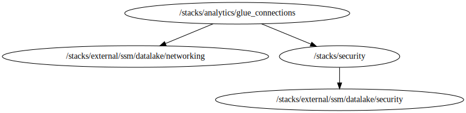

<!-- BEGIN_TF_DOCS -->

# Stack for deploying Glue Connections resources
Below is information on the modules and resources
## Modules info
- [terraform-aws-modules/ssm-parameter/aws](https://github.com/terraform-aws-modules/terraform-aws-ssm-parameter): Version 1.1.0
- [cloudposse/glue/aws//modules/glue-connection](https://github.com/cloudposse/terraform-aws-glue): Version 0.4.0

## Code Dependencies Graph
<center>

   

  ##### **Dependency Graph**

</center>

---

## Example parameter options for each environment

```hcl

 locals {
  env = {
    default = {
      #############################################################################
      # Commons Parameters
      #############################################################################
      export_parameters = false
      tags = {
        Environment = terraform.workspace
        Layer       = "Analytics"
      }
      #############################################################################
      # ssm_ps_connections Module
      #############################################################################
      connection_destinations = {
        alfaprd = {
          create      = true
          name        = "/${var.prefix}/${terraform.workspace}/alfaprd/connections"
          description = "List of connections to alfaprd"
        }
      }
      #############################################################################
      # glue_connections Module
      #############################################################################
      connection_alfaprd_dev = {
        create                 = true
        connection_name        = "${var.prefix}-${terraform.workspace}-alfaprd-dev-connection"
        connection_description = "Glue connection to alfaprd dev"
        connection_type        = "JDBC"
        connection_properties = {
          JDBC_CONNECTION_URL = "jdbc:oracle:thin:@//10.61.57.162:5521/ALFAPROD"
          SECRET_ID           = try(var.jdbc_secret_ids["alfaprd_dev"], "")
        }
        physical_connection_requirements = {
          security_group_id_list = [var.glue_connection_sg_id]
          availability_zone      = var.private_azs[0]
          subnet_id              = var.private_subnet_ids[0]
        }
      }

      connection_alfaprd_qa = {
        create                 = true
        connection_name        = "${var.prefix}-${terraform.workspace}-alfaprd-qa-connection"
        connection_description = "Glue connection to alfaprd qa"
        connection_type        = "JDBC"
        connection_properties = {
          JDBC_CONNECTION_URL = "jdbc:oracle:thin:@//10.61.57.162:5521/ALFAPROD"
          SECRET_ID           = try(var.jdbc_secret_ids["alfaprd_qa"], "")
        }
        physical_connection_requirements = {
          security_group_id_list = [var.glue_connection_sg_id]
          availability_zone      = var.private_azs[0]
          subnet_id              = var.private_subnet_ids[0]
        }
      }

      connection_alfaprd_cer = {
        create                 = true
        connection_name        = "${var.prefix}-${terraform.workspace}-alfaprd-cer-connection"
        connection_description = "Glue connection to alfaprd cer"
        connection_type        = "JDBC"
        connection_properties = {
          JDBC_CONNECTION_URL = "jdbc:oracle:thin:@//10.61.57.98:5521/ALPRODAC"
          SECRET_ID           = try(var.jdbc_secret_ids["alfaprd_cer"], "")
        }
        physical_connection_requirements = {
          security_group_id_list = [var.glue_connection_sg_id]
          availability_zone      = var.private_azs[0]
          subnet_id              = var.private_subnet_ids[0]
        }
      }

      connection_alfaprd_prd = {
        create                 = true
        connection_name        = "${var.prefix}-${terraform.workspace}-alfaprd-prd-connection"
        connection_description = "Glue connection to alfaprd prd"
        connection_type        = "JDBC"
        connection_properties = {
          JDBC_CONNECTION_URL = "jdbc:oracle:thin:@//10.61.56.199:5521/ALPRODAC"
          SECRET_ID           = try(var.jdbc_secret_ids["alfaprd_prd"], "")
        }
        physical_connection_requirements = {
          security_group_id_list = [var.glue_connection_sg_id]
          availability_zone      = var.private_azs[0]
          subnet_id              = var.private_subnet_ids[0]
        }
      }
    }
    dev = {
      used_connections = [
        "connection_alfaprd_dev",
        "connection_alfaprd_qa",
        "connection_alfaprd_cer",
      ]
    }
    qa = {
      used_connections = [
        "connection_alfaprd_dev",
        "connection_alfaprd_qa",
        "connection_alfaprd_cer",
      ]
    }
    prd = {
      used_connections = [
        "connection_alfaprd_prd",
      ]
    }
  }
  environmentvars = contains(keys(local.env), terraform.workspace) ? terraform.workspace : "default"
  workspace       = merge(local.env["default"], local.env[local.environmentvars])
}

```
## Requirements

No requirements.

## Providers

| Name | Version |
|------|---------|
| <a name="provider_aws"></a> [aws](#provider\_aws) | 5.97.0 |

## Modules

| Name | Source | Version |
|------|--------|---------|
| <a name="module_glue_connections"></a> [glue\_connections](#module\_glue\_connections) | cloudposse/glue/aws//modules/glue-connection | 0.4.0 |
| <a name="module_ssm_ps_connections"></a> [ssm\_ps\_connections](#module\_ssm\_ps\_connections) | terraform-aws-modules/ssm-parameter/aws | 1.1.0 |

## Resources

| Name | Type |
|------|------|
| [aws_caller_identity.current](https://registry.terraform.io/providers/hashicorp/aws/latest/docs/data-sources/caller_identity) | data source |
| [aws_region.current](https://registry.terraform.io/providers/hashicorp/aws/latest/docs/data-sources/region) | data source |

## Inputs

| Name | Description | Type | Default | Required |
|------|-------------|------|---------|:--------:|
| <a name="input_aws_access_key"></a> [aws\_access\_key](#input\_aws\_access\_key) | Variable for AWS Access Key | `string` | `null` | no |
| <a name="input_aws_secret_key"></a> [aws\_secret\_key](#input\_aws\_secret\_key) | Variable for AWS Secret Key | `string` | `null` | no |
| <a name="input_aws_token"></a> [aws\_token](#input\_aws\_token) | Variable for AWS Token | `string` | `null` | no |
| <a name="input_glue_connection_sg_id"></a> [glue\_connection\_sg\_id](#input\_glue\_connection\_sg\_id) | The ID of the glue connection security group | `string` | n/a | yes |
| <a name="input_jdbc_secret_ids"></a> [jdbc\_secret\_ids](#input\_jdbc\_secret\_ids) | Map with the IDs of the database credential secrets | `map(string)` | n/a | yes |
| <a name="input_prefix"></a> [prefix](#input\_prefix) | Prefix for naming resources | `string` | n/a | yes |
| <a name="input_private_azs"></a> [private\_azs](#input\_private\_azs) | List of availability zone of private subnets | `list(string)` | n/a | yes |
| <a name="input_private_subnet_ids"></a> [private\_subnet\_ids](#input\_private\_subnet\_ids) | A list of private subnet IDs | `list(string)` | n/a | yes |
| <a name="input_profile"></a> [profile](#input\_profile) | Variable for credentials management. | `map(map(string))` | n/a | yes |
| <a name="input_project"></a> [project](#input\_project) | Project name | `string` | n/a | yes |
| <a name="input_required_tags"></a> [required\_tags](#input\_required\_tags) | A map of tags to add to all resources | `map(string)` | n/a | yes |

## Outputs

| Name | Description |
|------|-------------|
| <a name="output_connection_names"></a> [connection\_names](#output\_connection\_names) | Glue Crawler names |
| <a name="output_ps_destination_names"></a> [ps\_destination\_names](#output\_ps\_destination\_names) | Names of connection parameters |

<!-- END_TF_DOCS -->