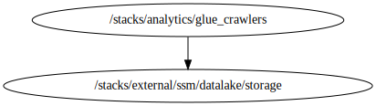

<!-- BEGIN_TF_DOCS -->

# Stack for deploying Glue Crawler resources
Below is information on the modules and resources
## Modules info
- [terraform-aws-modules/iam/aws//modules/iam-assumable-role](https://github.com/terraform-aws-modules/terraform-aws-iam): Version 5.44.1
- [cloudposse/glue/aws//modules/glue-crawler](https://github.com/cloudposse/terraform-aws-glue): Version 0.4.0

## Code Dependencies Graph
<center>

   

  ##### **Dependency Graph**

</center>

---

## Example parameter options for each environment

```hcl

 locals {
  env = {
    default = {
      #############################################################################
      # Commons Parameters
      #############################################################################
      export_parameters = false
      tags = {
        Environment = terraform.workspace
        Protected   = "Shared"
        Layer       = "Analytics"
      }
      #####################################################################
      # iam_roles
      #####################################################################
      inline_policies = {
        general = [
          {
            sid = "AllowEC2Actions"
            actions = [
              "ec2:*"
            ]
            effect    = "Allow"
            resources = ["*"]
          },
          {
            sid = "AllowLogsActions"
            actions = [
              "logs:*"
            ]
            effect    = "Allow"
            resources = ["arn:aws:logs:${data.aws_region.current.name}:${data.aws_caller_identity.current.account_id}:log-group:/aws-glue/*"]
          },
          {
            sid = "AllowS3Actions"
            actions = [
              "s3:ListBucket",
              "s3:GetBucketLocation"
            ]
            effect = "Allow"
            resources = [
              "arn:aws:s3:::aws-glue-assets-${data.aws_caller_identity.current.account_id}-${data.aws_region.current.name}",
              "arn:aws:s3:::${var.assets_bucket_id}",
              "arn:aws:s3:::${var.bronce_bucket_id}",
              "arn:aws:s3:::${var.silver_bucket_id}",
              "arn:aws:s3:::${var.gold_bucket_id}",
            ]
          },
          {
            sid = "AllowBucketActions"
            actions = [
              "s3:PutObject",
              "s3:GetObject",
            ]
            effect = "Allow"
            resources = [
              "arn:aws:s3:::aws-glue-assets-${data.aws_caller_identity.current.account_id}-${data.aws_region.current.name}/*",
              "arn:aws:s3:::${var.assets_bucket_id}/*",
              "arn:aws:s3:::${var.bronce_bucket_id}/*",
              "arn:aws:s3:::${var.silver_bucket_id}/*",
              "arn:aws:s3:::${var.gold_bucket_id}/*",
            ]
          },
          {
            sid = "AllowGlueActions"
            actions = [
              "glue:GetTable",
              "glue:GetTables",
              "glue:GetTableVersion",
              "glue:GetTableVersions",
              "glue:GetPartition",
              "glue:GetPartitions",
              "glue:GetDatabase",
              "glue:GetConnection",
              "glue:CreateTable",
              "glue:UpdateTable",
              "glue:UpdatePartition",
              "glue:BatchGetPartition",
              "glue:BatchCreatePartition",
              "glue:PublishDataQuality"
            ]
            effect = "Allow"
            resources = [
              "arn:aws:glue:${data.aws_region.current.name}:${data.aws_caller_identity.current.account_id}:catalog",
              "arn:aws:glue:${data.aws_region.current.name}:${data.aws_caller_identity.current.account_id}:database/default",
              "arn:aws:glue:${data.aws_region.current.name}:${data.aws_caller_identity.current.account_id}:table/default/*",
              "arn:aws:glue:${data.aws_region.current.name}:${data.aws_caller_identity.current.account_id}:database/${var.prefix}-${terraform.workspace}*",
              "arn:aws:glue:${data.aws_region.current.name}:${data.aws_caller_identity.current.account_id}:table/${var.prefix}-${terraform.workspace}*",
              "arn:aws:glue:${data.aws_region.current.name}:${data.aws_caller_identity.current.account_id}:connection/${var.prefix}-${terraform.workspace}*",
            ]
          },
          {
            sid = "AllowLakeformationActions"
            actions = [
              "lakeformation:*"
            ]
            effect    = "Allow"
            resources = ["*"]
          }
        ]
      }

      crawler_roles = {
        bronce_layer = {
          create_role       = true
          role_name         = "${var.prefix}-${terraform.workspace}-niif-crawler-bronce-layer"
          role_requires_mfa = false
          trusted_role_services = [
            "glue.amazonaws.com"
          ]
          inline_policy           = "general"
          custom_role_policy_arns = []
        }
        silver_layer = {
          create_role       = true
          role_name         = "${var.prefix}-${terraform.workspace}-niif-crawler-silver-layer"
          role_requires_mfa = false
          trusted_role_services = [
            "glue.amazonaws.com"
          ]
          inline_policy           = "general"
          custom_role_policy_arns = []
        }
        gold_layer = {
          create_role       = true
          role_name         = "${var.prefix}-${terraform.workspace}-niif-crawler-gold-layer"
          role_requires_mfa = false
          trusted_role_services = [
            "glue.amazonaws.com"
          ]
          inline_policy           = "general"
          custom_role_policy_arns = []
        }
      }
      #####################################################################
      # glue_crawlers module
      #####################################################################
      alfprd_arpprod_bronce = {
        create              = true
        crawler_name        = "${var.prefix}-${terraform.workspace}-alfprd-arpprod-bronce"
        crawler_description = "Glue crawler for save data on data catalog from s3 arpprod"
        database            = "${var.prefix}-${terraform.workspace}-bronce-catalog-db"
        role                = null
        schedule            = null
        table_prefix        = "alfaprd_arpprod_"
        configuration = jsonencode(
          {
            Version              = 1
            CreatePartitionIndex = true
          }
        )
        recrawl_policy = {
          recrawl_behavior = "CRAWL_EVERYTHING"
        }
        schema_change_policy = {
          delete_behavior = "DEPRECATE_IN_DATABASE"
          update_behavior = "UPDATE_IN_DATABASE"
        }
        lineage_configuration = {
          crawler_lineage_settings = "DISABLE"
        }

        s3_target = [
          { path = "s3://${var.bronce_bucket_id}/ALFAPRD/ARPPROD/GAR_TIPOS_ENDOSOS_ARP/" },
          { path = "s3://${var.bronce_bucket_id}/ALFAPRD/ARPPROD/PAR_ENDOSOS/" },
          { path = "s3://${var.bronce_bucket_id}/ALFAPRD/ARPPROD/PAR_POLIZAS/" },
          { path = "s3://${var.bronce_bucket_id}/ALFAPRD/ARPPROD/HIST_DATOS_INVALIDEZ_MUERTE/" },
          { path = "s3://${var.bronce_bucket_id}/ALFAPRD/ARPPROD/SAR_RESERVA_PCJ_AMORTIZACION/" },
          { path = "s3://${var.bronce_bucket_id}/ALFAPRD/ARPPROD/SAR_SINIESTROS/" },
          { path = "s3://${var.bronce_bucket_id}/ALFAPRD/ARPPROD/IND_DATOS_RESERVAS_SINIESTROS/" },
          { path = "s3://${var.bronce_bucket_id}/ALFAPRD/ARPPROD/PAR_TRABAJADORES/" },
          { path = "s3://${var.bronce_bucket_id}/ALFAPRD/ARPPROD/SAR_AUDITORIA_MEDICA/" },
          { path = "s3://${var.bronce_bucket_id}/ALFAPRD/ARPPROD/SAR_BENEFICIARIOS_SINIESTROS/" },
          { path = "s3://${var.bronce_bucket_id}/ALFAPRD/ARPPROD/SAR_DATOS_INVALIDEZ_MUERTE/" },
          { path = "s3://${var.bronce_bucket_id}/ALFAPRD/ARPPROD/HIST_SAR_PCL_PENSION/" },
        ]

        role = "bronce_layer"
      }

      alfprd_general_bronce = {
        create              = true
        crawler_name        = "${var.prefix}-${terraform.workspace}-alfprd-general-bronce"
        crawler_description = "Glue crawler for save data on data catalog from s3 general"
        database            = "${var.prefix}-${terraform.workspace}-bronce-catalog-db"
        role                = null
        schedule            = null
        table_prefix        = "alfaprd_general_"
        configuration = jsonencode(
          {
            Version              = 1
            CreatePartitionIndex = true
          }
        )
        recrawl_policy = {
          recrawl_behavior = "CRAWL_EVERYTHING"
        }
        schema_change_policy = {
          delete_behavior = "DEPRECATE_IN_DATABASE"
          update_behavior = "UPDATE_IN_DATABASE"
        }
        lineage_configuration = {
          crawler_lineage_settings = "DISABLE"
        }

        s3_target = [
          { path = "s3://${var.bronce_bucket_id}/ALFAPRD/GENERAL/ANP_PENSIONES/" },
          { path = "s3://${var.bronce_bucket_id}/ALFAPRD/GENERAL/ANP_DETALLE_SOLICITUDES_GIRO/" },
          { path = "s3://${var.bronce_bucket_id}/ALFAPRD/GENERAL/ACU_PERSONAS_NATURALES/" },
          { path = "s3://${var.bronce_bucket_id}/ALFAPRD/GENERAL/ANP_DISTRIBUCION_VIG_PENSION/" },
          { path = "s3://${var.bronce_bucket_id}/ALFAPRD/GENERAL/ANP_PENSIONADO_NOVEDAD/" },
          { path = "s3://${var.bronce_bucket_id}/ALFAPRD/GENERAL/ANP_PERIODO_SOLICITUDES_GIRO/" },
          { path = "s3://${var.bronce_bucket_id}/ALFAPRD/GENERAL/CGR_CONCEPTOS/" },
          { path = "s3://${var.bronce_bucket_id}/ALFAPRD/GENERAL/CGR_TIPOS_ENDOSOS/" },
          { path = "s3://${var.bronce_bucket_id}/ALFAPRD/GENERAL/CGR_TIPOS_IDENTIFICACIONES/" },
          { path = "s3://${var.bronce_bucket_id}/ALFAPRD/GENERAL/CGR_ORIGENES/" },
          { path = "s3://${var.bronce_bucket_id}/ALFAPRD/GENERAL/CGR_EQUIVALENCIA_TIPOS_ID/" },
          { path = "s3://${var.bronce_bucket_id}/ALFAPRD/GENERAL/CGR_PARENTESCOS/" },
          { path = "s3://${var.bronce_bucket_id}/ALFAPRD/GENERAL/CGR_ESTADOS_PERSONAS/" },
          { path = "s3://${var.bronce_bucket_id}/ALFAPRD/GENERAL/RVA_RESERVA_MATEMATICA_TRANSIC/" },
          { path = "s3://${var.bronce_bucket_id}/ALFAPRD/GENERAL/PGR_SALARIOS_MINIMOS/" },
          { path = "s3://${var.bronce_bucket_id}/ALFAPRD/GENERAL/ANP_IPC" },
        ]

        role = "bronce_layer"
      }

      alfprd_prv_bronce = {
        create              = true
        crawler_name        = "${var.prefix}-${terraform.workspace}-alfprd-prv-bronce"
        crawler_description = "Glue crawler for save data on data catalog from s3 prv"
        database            = "${var.prefix}-${terraform.workspace}-bronce-catalog-db"
        role                = null
        schedule            = null
        table_prefix        = "alfaprd_prv_"
        configuration = jsonencode(
          {
            Version              = 1
            CreatePartitionIndex = true
          }
        )
        recrawl_policy = {
          recrawl_behavior = "CRAWL_EVERYTHING"
        }
        schema_change_policy = {
          delete_behavior = "DEPRECATE_IN_DATABASE"
          update_behavior = "UPDATE_IN_DATABASE"
        }
        lineage_configuration = {
          crawler_lineage_settings = "DISABLE"
        }

        s3_target = [
          { path = "s3://${var.bronce_bucket_id}/ALFAPRD/PRV/PRV_BENEFICIARIOS/" },
          { path = "s3://${var.bronce_bucket_id}/ALFAPRD/PRV/PRV_ENDOSOS_POINT/" },
          { path = "s3://${var.bronce_bucket_id}/ALFAPRD/PRV/PRV_RENTAS/" },
          { path = "s3://${var.bronce_bucket_id}/ALFAPRD/PRV/PRV_RENTAS_APROBADAS_OBP/" },
          { path = "s3://${var.bronce_bucket_id}/ALFAPRD/PRV/CRV_PORCENTAJES_AMORTIZACION/" },
          { path = "s3://${var.bronce_bucket_id}/ALFAPRD/PRV/PRV_ENDOSO_RECAUDOS/" },
          { path = "s3://${var.bronce_bucket_id}/ALFAPRD/PRV/SPR_SINIESTROS/" },
          { path = "s3://${var.bronce_bucket_id}/ALFAPRD/PRV/PRV_SALDOS_MATEMATICA/" },
          { path = "s3://${var.bronce_bucket_id}/ALFAPRD/PRV/PRV_RENTAS_NOTAS/" },
        ]

        role = "bronce_layer"
      }

      alfprd_arpprod_silver = {
        create              = true
        crawler_name        = "${var.prefix}-${terraform.workspace}-alfprd-arpprod-silver"
        crawler_description = "Glue crawler for save data on data catalog from s3 arpprod silver"
        database            = "${var.prefix}-${terraform.workspace}-silver-catalog-db"
        role                = null
        schedule            = null
        table_prefix        = "alfaprd_arpprod_"
        configuration = jsonencode(
          {
            Version              = 1
            CreatePartitionIndex = true
          }
        )
        recrawl_policy = {
          recrawl_behavior = "CRAWL_EVERYTHING"
        }
        schema_change_policy = {
          delete_behavior = "DEPRECATE_IN_DATABASE"
          update_behavior = "UPDATE_IN_DATABASE"
        }
        lineage_configuration = {
          crawler_lineage_settings = "DISABLE"
        }

        s3_target = [
          { path = "s3://${var.silver_bucket_id}/ALFAPRD/ARPPROD/SILVER_HIST_DATOS_INVALIDEZ_MUERTE/" },
          { path = "s3://${var.silver_bucket_id}/ALFAPRD/ARPPROD/SILVER_PAR_TRABAJADORES/" },
          { path = "s3://${var.silver_bucket_id}/ALFAPRD/ARPPROD/SILVER_SAR_AUDITORIA_MEDICA/" },
          { path = "s3://${var.silver_bucket_id}/ALFAPRD/ARPPROD/SILVER_SAR_BENEFICIARIOS_SINIESTROS/" },
          { path = "s3://${var.silver_bucket_id}/ALFAPRD/ARPPROD/SILVER_SAR_SINIESTROS/" },
          { path = "s3://${var.silver_bucket_id}/ALFAPRD/ARPPROD/SILVER_IND_DATOS_RESERVAS_SINIESTROS/" },
          { path = "s3://${var.silver_bucket_id}/ALFAPRD/ARPPROD/SILVER_SAR_RESERVA_PCJ_AMORTIZACION/" },
          { path = "s3://${var.silver_bucket_id}/ALFAPRD/ARPPROD/SILVER_HIST_SAR_PCL_PENSION/" },
          { path = "s3://${var.silver_bucket_id}/ALFAPRD/ARPPROD/SILVER_SAR_DATOS_INVALIDEZ_MUERTE/" },
        ]

        role = "silver_layer"
      }

      alfprd_general_silver = {
        create              = true
        crawler_name        = "${var.prefix}-${terraform.workspace}-alfprd-general-silver"
        crawler_description = "Glue crawler for save data on data catalog from s3 general silver"
        database            = "${var.prefix}-${terraform.workspace}-silver-catalog-db"
        role                = null
        schedule            = null
        table_prefix        = "alfaprd_general_"
        configuration = jsonencode(
          {
            Version              = 1
            CreatePartitionIndex = true
          }
        )
        recrawl_policy = {
          recrawl_behavior = "CRAWL_EVERYTHING"
        }
        schema_change_policy = {
          delete_behavior = "DEPRECATE_IN_DATABASE"
          update_behavior = "UPDATE_IN_DATABASE"
        }
        lineage_configuration = {
          crawler_lineage_settings = "DISABLE"
        }

        s3_target = [
          { path = "s3://${var.silver_bucket_id}/ALFAPRD/GENERAL/SILVER_ACU_PERSONAS_NATURALES/" },
          { path = "s3://${var.silver_bucket_id}/ALFAPRD/GENERAL/SILVER_ANP_DETALLE_SOLICITUDES_GIRO/" },
          { path = "s3://${var.silver_bucket_id}/ALFAPRD/GENERAL/SILVER_ANP_DISTRIBUCION_VIG_PENSION/" },
          { path = "s3://${var.silver_bucket_id}/ALFAPRD/GENERAL/SILVER_ANP_PENSIONADO_NOVEDAD/" },
          { path = "s3://${var.silver_bucket_id}/ALFAPRD/GENERAL/SILVER_ANP_PENSIONES/" },
          { path = "s3://${var.silver_bucket_id}/ALFAPRD/GENERAL/SILVER_ANP_PERIODO_SOLICITUDES_GIRO/" },
          { path = "s3://${var.silver_bucket_id}/ALFAPRD/GENERAL/SILVER_CGR_CONCEPTOS/" },
          { path = "s3://${var.silver_bucket_id}/ALFAPRD/GENERAL/SILVER_CGR_ORIGENES/" },
          { path = "s3://${var.silver_bucket_id}/ALFAPRD/GENERAL/SILVER_CGR_TIPOS_IDENTIFICACIONES/" },
          { path = "s3://${var.silver_bucket_id}/ALFAPRD/GENERAL/SILVER_CGR_EQUIVALENCIA_TIPOS_ID/" },
          { path = "s3://${var.silver_bucket_id}/ALFAPRD/GENERAL/SILVER_CGR_ESTADOS_PERSONAS/" },
          { path = "s3://${var.silver_bucket_id}/ALFAPRD/GENERAL/SILVER_CGR_PARENTESCOS/" },
          { path = "s3://${var.silver_bucket_id}/ALFAPRD/GENERAL/SILVER_ANP_IPC/" },
          { path = "s3://${var.silver_bucket_id}/ALFAPRD/GENERAL/SILVER_RVA_RESERVA_MATEMATICA_TRANSIC/" },
          { path = "s3://${var.silver_bucket_id}/ALFAPRD/GENERAL/SILVER_PGR_SALARIOS_MINIMOS/" },
        ]

        role = "silver_layer"
      }

      alfprd_prv_silver = {
        create              = true
        crawler_name        = "${var.prefix}-${terraform.workspace}-alfprd-prv-silver"
        crawler_description = "Glue crawler for save data on data catalog from s3 prv silver"
        database            = "${var.prefix}-${terraform.workspace}-silver-catalog-db"
        role                = null
        schedule            = null
        table_prefix        = "alfaprd_prv_"
        configuration = jsonencode(
          {
            Version              = 1
            CreatePartitionIndex = true
          }
        )
        recrawl_policy = {
          recrawl_behavior = "CRAWL_EVERYTHING"
        }
        schema_change_policy = {
          delete_behavior = "DEPRECATE_IN_DATABASE"
          update_behavior = "UPDATE_IN_DATABASE"
        }
        lineage_configuration = {
          crawler_lineage_settings = "DISABLE"
        }

        s3_target = [
          { path = "s3://${var.silver_bucket_id}/ALFAPRD/PRV/SILVER_PRV_RENTAS/" },
          { path = "s3://${var.silver_bucket_id}/ALFAPRD/PRV/SILVER_PRV_ENDOSOS_POINT/" },
          { path = "s3://${var.silver_bucket_id}/ALFAPRD/PRV/SILVER_PRV_SALDOS_MATEMATICA/" },
          { path = "s3://${var.silver_bucket_id}/ALFAPRD/PRV/SILVER_PRV_BENEFICIARIOS/" },
          { path = "s3://${var.silver_bucket_id}/ALFAPRD/PRV/SILVER_PRV_RENTAS_NOTAS/" },
          { path = "s3://${var.silver_bucket_id}/ALFAPRD/PRV/SILVER_PRV_RENTAS_APROBADAS_OBP/" },
          { path = "s3://${var.silver_bucket_id}/ALFAPRD/PRV/SILVER_SPR_SINIESTROS/" },
        ]

        role = "silver_layer"
      }

      niff_gold = {
        create              = true
        crawler_name        = "${var.prefix}-${terraform.workspace}-niff-gold"
        crawler_description = "Glue crawler for save data on data catalog from s3 use cases niif"
        database            = "${var.prefix}-${terraform.workspace}-gold-catalog-db"
        role                = null
        schedule            = null
        table_prefix        = "niif_"
        configuration = jsonencode(
          {
            Version              = 1
            CreatePartitionIndex = true
          }
        )
        recrawl_policy = {
          recrawl_behavior = "CRAWL_EVERYTHING"
        }
        schema_change_policy = {
          delete_behavior = "DEPRECATE_IN_DATABASE"
          update_behavior = "UPDATE_IN_DATABASE"
        }
        lineage_configuration = {
          crawler_lineage_settings = "DISABLE"
        }

        s3_target = [
          { path = "s3://${var.gold_bucket_id}/GOLD/NIIF/AUXILIOS_FUNERARIOS_GOLD/" },
          { path = "s3://${var.gold_bucket_id}/GOLD/NIIF/PRIMAS_RENTAS_GOLD/" },
          { path = "s3://${var.gold_bucket_id}/GOLD/NIIF/RESERVA_GOLD/" },
        ]

        role = "gold_layer"
      }
    }
    dev = {
      used_crawlers = [
        "alfprd_arpprod_bronce",
        "alfprd_general_bronce",
        "alfprd_prv_bronce",
        "alfprd_arpprod_silver",
        "alfprd_general_silver",
        "alfprd_prv_silver",
        "niff_gold"
      ]
    }
    qa = {
      used_crawlers = [
        "alfprd_arpprod_bronce",
        "alfprd_general_bronce",
        "alfprd_prv_bronce",
        "alfprd_arpprod_silver",
        "alfprd_general_silver",
        "alfprd_prv_silver",
        "niff_gold"
      ]
    }
    prd = {
      used_crawlers = [
        "alfprd_general_bronce",
        "alfprd_general_silver",
        "niff_gold"
      ]

      alfprd_general_silver = {
        create              = true
        crawler_name        = "${var.prefix}-${terraform.workspace}-alfprd-general-silver"
        crawler_description = "Glue crawler for save data on data catalog from s3 general silver"
        database            = "${var.prefix}-${terraform.workspace}-silver-catalog-db"
        role                = null
        schedule            = null
        table_prefix        = "alfaprd_general_"
        configuration = jsonencode(
          {
            Version              = 1
            CreatePartitionIndex = true
          }
        )
        recrawl_policy = {
          recrawl_behavior = "CRAWL_EVERYTHING"
        }
        schema_change_policy = {
          delete_behavior = "DEPRECATE_IN_DATABASE"
          update_behavior = "UPDATE_IN_DATABASE"
        }
        lineage_configuration = {
          crawler_lineage_settings = "DISABLE"
        }

        s3_target = [
          { path = "s3://${var.silver_bucket_id}/ALFAPRD/GENERAL/SILVER_ANP_DETALLE_SOLICITUDES_GIRO/" },
          { path = "s3://${var.silver_bucket_id}/ALFAPRD/GENERAL/SILVER_ANP_DISTRIBUCION_VIG_PENSION/" },
          { path = "s3://${var.silver_bucket_id}/ALFAPRD/GENERAL/SILVER_ANP_PENSIONADO_NOVEDAD/" },
          { path = "s3://${var.silver_bucket_id}/ALFAPRD/GENERAL/SILVER_ANP_PENSIONES/" },
          { path = "s3://${var.silver_bucket_id}/ALFAPRD/GENERAL/SILVER_ANP_PERIODO_SOLICITUDES_GIRO/" },
          { path = "s3://${var.silver_bucket_id}/ALFAPRD/GENERAL/SILVER_CGR_CONCEPTOS/" },
          { path = "s3://${var.silver_bucket_id}/ALFAPRD/GENERAL/SILVER_CGR_ORIGENES/" },
        ]

        role = "silver_layer"
      }
    }
  }
  environmentvars = contains(keys(local.env), terraform.workspace) ? terraform.workspace : "default"
  workspace       = merge(local.env["default"], local.env[local.environmentvars])
}

```
## Requirements

No requirements.

## Providers

| Name | Version |
|------|---------|
| <a name="provider_aws"></a> [aws](#provider\_aws) | 5.97.0 |

## Modules

| Name | Source | Version |
|------|--------|---------|
| <a name="module_crawler_iam_roles"></a> [crawler\_iam\_roles](#module\_crawler\_iam\_roles) | terraform-aws-modules/iam/aws//modules/iam-assumable-role | 5.44.1 |
| <a name="module_glue_crawlers"></a> [glue\_crawlers](#module\_glue\_crawlers) | cloudposse/glue/aws//modules/glue-crawler | 0.4.0 |

## Resources

| Name | Type |
|------|------|
| [aws_caller_identity.current](https://registry.terraform.io/providers/hashicorp/aws/latest/docs/data-sources/caller_identity) | data source |
| [aws_region.current](https://registry.terraform.io/providers/hashicorp/aws/latest/docs/data-sources/region) | data source |

## Inputs

| Name | Description | Type | Default | Required |
|------|-------------|------|---------|:--------:|
| <a name="input_assets_bucket_id"></a> [assets\_bucket\_id](#input\_assets\_bucket\_id) | ID of the bucket where the assets are stored | `string` | n/a | yes |
| <a name="input_aws_access_key"></a> [aws\_access\_key](#input\_aws\_access\_key) | Variable for AWS Access Key | `string` | `null` | no |
| <a name="input_aws_secret_key"></a> [aws\_secret\_key](#input\_aws\_secret\_key) | Variable for AWS Secret Key | `string` | `null` | no |
| <a name="input_aws_token"></a> [aws\_token](#input\_aws\_token) | Variable for AWS Token | `string` | `null` | no |
| <a name="input_bronce_bucket_id"></a> [bronce\_bucket\_id](#input\_bronce\_bucket\_id) | ID of the bucket where the data bronce are stored | `string` | n/a | yes |
| <a name="input_gold_bucket_id"></a> [gold\_bucket\_id](#input\_gold\_bucket\_id) | ID of the bucket where the data gold are stored | `string` | n/a | yes |
| <a name="input_prefix"></a> [prefix](#input\_prefix) | Prefix for naming resources | `string` | n/a | yes |
| <a name="input_profile"></a> [profile](#input\_profile) | Variable for credentials management. | `map(map(string))` | n/a | yes |
| <a name="input_project"></a> [project](#input\_project) | Project name | `string` | n/a | yes |
| <a name="input_required_tags"></a> [required\_tags](#input\_required\_tags) | A map of tags to add to all resources | `map(string)` | n/a | yes |
| <a name="input_silver_bucket_id"></a> [silver\_bucket\_id](#input\_silver\_bucket\_id) | ID of the bucket where the data silver are stored | `string` | n/a | yes |

## Outputs

| Name | Description |
|------|-------------|
| <a name="output_crawler_names"></a> [crawler\_names](#output\_crawler\_names) | Glue crawler names |

<!-- END_TF_DOCS -->