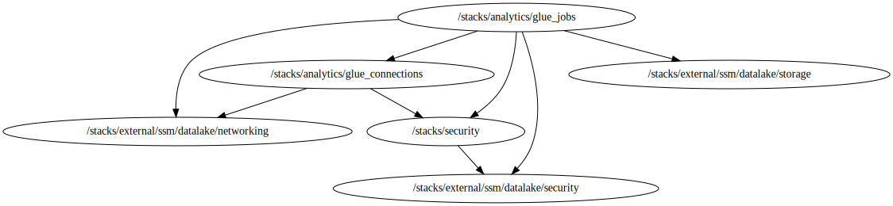

<!-- BEGIN_TF_DOCS -->

# Stack for deploying Glue Jobs resources
Below is information on the modules and resources
## Modules info
- [terraform-aws-modules/iam/aws//modules/iam-assumable-role](https://github.com/terraform-aws-modules/terraform-aws-iam): Version 5.44.1
- [cloudposse/glue/aws//modules/glue-crawler](https://github.com/cloudposse/terraform-aws-glue): Version 0.4.0

## Code Dependencies Graph
<center>

   

  ##### **Dependency Graph**

</center>

---

## Example parameter options for each environment

```hcl

 locals {
  env = {
    default = {
      #############################################################################
      # Commons Parameters
      #############################################################################
      export_parameters = false
      tags = {
        Environment = terraform.workspace
        Protected   = "Shared"
        Layer       = "Analytics"
      }
      #####################################################################
      # iam_roles
      #####################################################################
      inline_policies = {
        general = [
          {
            sid = "AllowEC2Actions"
            actions = [
              "ec2:*"
            ]
            effect    = "Allow"
            resources = ["*"]
          },
          {
            sid = "AllowLogsActions"
            actions = [
              "logs:*"
            ]
            effect    = "Allow"
            resources = ["arn:aws:logs:${data.aws_region.current.name}:${data.aws_caller_identity.current.account_id}:log-group:/aws-glue/*"]
          },
          {
            sid = "AllowS3Actions"
            actions = [
              "s3:ListBucket",
              "s3:GetBucketLocation"
            ]
            effect = "Allow"
            resources = [
              "arn:aws:s3:::aws-glue-assets-${data.aws_caller_identity.current.account_id}-${data.aws_region.current.name}",
              "arn:aws:s3:::${var.assets_bucket_id}",
              "arn:aws:s3:::${var.bronce_bucket_id}",
              "arn:aws:s3:::${var.silver_bucket_id}",
              "arn:aws:s3:::${var.gold_bucket_id}",
            ]
          },
          {
            sid = "AllowBucketActions"
            actions = [
              "s3:PutObject",
              "s3:GetObject",
              "s3:DeleteObject",
            ]
            effect = "Allow"
            resources = [
              "arn:aws:s3:::aws-glue-assets-${data.aws_caller_identity.current.account_id}-${data.aws_region.current.name}/*",
              "arn:aws:s3:::${var.assets_bucket_id}/*",
              "arn:aws:s3:::${var.bronce_bucket_id}/*",
              "arn:aws:s3:::${var.silver_bucket_id}/*",
              "arn:aws:s3:::${var.gold_bucket_id}/*",
            ]
          },
          {
            sid       = "AllowSecretsManagerActions"
            actions   = ["secretsmanager:GetSecretValue"]
            effect    = "Allow"
            resources = values(var.jdbc_secret_ids)
          },
          {
            sid = "AllowGlueActions"
            actions = [
              "glue:GetTable",
              "glue:GetTables",
              "glue:GetTableVersion",
              "glue:GetTableVersions",
              "glue:GetPartition",
              "glue:GetPartitions",
              "glue:GetDatabase",
              "glue:GetConnection",
              "glue:CreateTable",
              "glue:UpdateTable",
              "glue:UpdatePartition",
              "glue:BatchGetPartition",
              "glue:BatchCreatePartition",
              "glue:PublishDataQuality"
            ]
            effect = "Allow"
            resources = [
              "arn:aws:glue:${data.aws_region.current.name}:${data.aws_caller_identity.current.account_id}:catalog",
              "arn:aws:glue:${data.aws_region.current.name}:${data.aws_caller_identity.current.account_id}:database/default",
              "arn:aws:glue:${data.aws_region.current.name}:${data.aws_caller_identity.current.account_id}:table/default/*",
              "arn:aws:glue:${data.aws_region.current.name}:${data.aws_caller_identity.current.account_id}:database/${var.prefix}-${terraform.workspace}*",
              "arn:aws:glue:${data.aws_region.current.name}:${data.aws_caller_identity.current.account_id}:table/${var.prefix}-${terraform.workspace}*",
              "arn:aws:glue:${data.aws_region.current.name}:${data.aws_caller_identity.current.account_id}:connection/${var.prefix}-${terraform.workspace}*",
              "arn:aws:glue:${data.aws_region.current.name}:${data.aws_caller_identity.current.account_id}:dataQualityRuleset/*",
            ]
          },
          {
            sid = "AllowLakeformationActions"
            actions = [
              "lakeformation:*"
            ]
            effect    = "Allow"
            resources = ["*"]
          },
          {
            sid = "AllowSSMActions"
            actions = [
              "ssm:GetParameter"
            ]
            effect    = "Allow"
            resources = ["arn:aws:ssm:${data.aws_region.current.name}:${data.aws_caller_identity.current.account_id}:parameter/datalake/${terraform.workspace}/niif*"]
          }
        ]
      }

      job_roles = {
        bronce_layer = {
          create_role       = true
          role_name         = "${var.prefix}-${terraform.workspace}-niif-jobs-bronce-layer"
          role_requires_mfa = false
          trusted_role_services = [
            "glue.amazonaws.com"
          ]
          inline_policy           = "general"
          custom_role_policy_arns = []
        }
        silver_layer = {
          create_role       = true
          role_name         = "${var.prefix}-${terraform.workspace}-niif-jobs-silver-layer"
          role_requires_mfa = false
          trusted_role_services = [
            "glue.amazonaws.com"
          ]
          inline_policy           = "general"
          custom_role_policy_arns = []
        }
        gold_layer = {
          create_role       = true
          role_name         = "${var.prefix}-${terraform.workspace}-niif-jobs-gold-layer"
          role_requires_mfa = false
          trusted_role_services = [
            "glue.amazonaws.com"
          ]
          inline_policy           = "general"
          custom_role_policy_arns = []
        }
      }

      ######################################################################
      # glue_jobs Module
      ######################################################################
      job_alfprd_general_bronce_extract = {
        create          = true
        job_name        = "${var.prefix}-${terraform.workspace}-alfprd-general-bronce-extract"
        job_description = "Job to extract data from alfprd general"
        role            = "bronce_layer"
        glue_version    = "4.0"
        default_arguments = {
          "--enable-metrics"                   = "true"
          "--enable-continuous-cloudwatch-log" = "true"
          "--enable-job-insights"              = "true"
          "--enable-spark-ui"                  = "true"
          "--enable-glue-datacatalog"          = "true"
          "--job-language"                     = "python"
          "--job-bookmark-option"              = "job-bookmark-disable"
          "--spark-event-logs-path"            = "s3://aws-glue-assets-${data.aws_caller_identity.current.account_id}-${data.aws_region.current.name}/sparkHistoryLogs/"
          "--TempDir"                          = "s3://aws-glue-assets-${data.aws_caller_identity.current.account_id}-${data.aws_region.current.name}/temporary/"
          "--extra-py-files" = format("%s,%s,%s,%s",
            "s3://${var.assets_bucket_id}/glue_resources/niff/libraries/commons.zip",
            "s3://${var.assets_bucket_id}/glue_resources/wheelhouse/openpyxl-3.0.10-py2.py3-none-any.whl",
            "s3://${var.assets_bucket_id}/glue_resources/wheelhouse/pyxlsb-1.0.8-py2.py3-none-any.whl",
          "s3://${var.assets_bucket_id}/glue_resources/wheelhouse/et_xmlfile-2.0.0-py3-none-any.whl")
          "--BUCKET_NAME_ASSETS" = var.assets_bucket_id
          "--BUCKET_NAME"        = var.bronce_bucket_id
          "--CERTIFICATE"        = "False"
          "--CONNECT_NAME"       = "${var.prefix}-${terraform.workspace}-alfaprd-cer-connection"
          "--DB_NAME"            = "ALFAPRD"
          "--DB_SCHEMA"          = "GENERAL"
          "--PERIOD"             = "202501"
        }

        worker_type       = "G.1X"
        number_of_workers = 10
        max_retries       = 0
        timeout           = 2880

        command = {
          name            = "glueetl"
          python_version  = 3
          script_location = "s3://${var.assets_bucket_id}/glue_resources/niff/jobs/bronce_extract.py"
        }

        execution_property = {
          max_concurrent_runs = "1"
        }
      }

      job_alfprd_prv_bronce_extract = {
        create          = true
        job_name        = "${var.prefix}-${terraform.workspace}-alfprd-prv-bronce-extract"
        job_description = "Job to extract data from alfprd prv"
        role            = "bronce_layer"
        glue_version    = "4.0"
        default_arguments = {
          "--enable-metrics"                   = "true"
          "--enable-continuous-cloudwatch-log" = "true"
          "--enable-job-insights"              = "true"
          "--enable-spark-ui"                  = "true"
          "--enable-glue-datacatalog"          = "true"
          "--job-language"                     = "python"
          "--job-bookmark-option"              = "job-bookmark-disable"
          "--spark-event-logs-path"            = "s3://aws-glue-assets-${data.aws_caller_identity.current.account_id}-${data.aws_region.current.name}/sparkHistoryLogs/"
          "--TempDir"                          = "s3://aws-glue-assets-${data.aws_caller_identity.current.account_id}-${data.aws_region.current.name}/temporary/"
          "--extra-py-files" = format("%s,%s,%s,%s",
            "s3://${var.assets_bucket_id}/glue_resources/niff/libraries/commons.zip",
            "s3://${var.assets_bucket_id}/glue_resources/wheelhouse/openpyxl-3.0.10-py2.py3-none-any.whl",
            "s3://${var.assets_bucket_id}/glue_resources/wheelhouse/pyxlsb-1.0.8-py2.py3-none-any.whl",
          "s3://${var.assets_bucket_id}/glue_resources/wheelhouse/et_xmlfile-2.0.0-py3-none-any.whl")
          "--BUCKET_NAME_ASSETS" = var.assets_bucket_id
          "--BUCKET_NAME"        = var.bronce_bucket_id
          "--CERTIFICATE"        = "False"
          "--CONNECT_NAME"       = "${var.prefix}-${terraform.workspace}-alfaprd-qa-connection"
          "--DB_NAME"            = "ALFAPRD"
          "--DB_SCHEMA"          = "PRV"
          "--PERIOD"             = "202501"
        }

        worker_type       = "G.1X"
        number_of_workers = 10
        max_retries       = 0
        timeout           = 2880

        command = {
          name            = "glueetl"
          python_version  = 3
          script_location = "s3://${var.assets_bucket_id}/glue_resources/niff/jobs/bronce_extract.py"
        }

        execution_property = {
          max_concurrent_runs = "1"
        }
      }

      job_alfprd_arpprod_bronce_extract = {
        create          = true
        job_name        = "${var.prefix}-${terraform.workspace}-alfprd-arpprod-bronce-extract"
        job_description = "Job to extract data from alfprd arpprod"
        role            = "bronce_layer"
        glue_version    = "4.0"
        default_arguments = {
          "--enable-metrics"                   = "true"
          "--enable-continuous-cloudwatch-log" = "true"
          "--enable-job-insights"              = "true"
          "--enable-spark-ui"                  = "true"
          "--enable-glue-datacatalog"          = "true"
          "--job-language"                     = "python"
          "--job-bookmark-option"              = "job-bookmark-disable"
          "--spark-event-logs-path"            = "s3://aws-glue-assets-${data.aws_caller_identity.current.account_id}-${data.aws_region.current.name}/sparkHistoryLogs/"
          "--TempDir"                          = "s3://aws-glue-assets-${data.aws_caller_identity.current.account_id}-${data.aws_region.current.name}/temporary/"
          "--extra-py-files" = format("%s,%s,%s,%s",
            "s3://${var.assets_bucket_id}/glue_resources/niff/libraries/commons.zip",
            "s3://${var.assets_bucket_id}/glue_resources/wheelhouse/openpyxl-3.0.10-py2.py3-none-any.whl",
            "s3://${var.assets_bucket_id}/glue_resources/wheelhouse/pyxlsb-1.0.8-py2.py3-none-any.whl",
          "s3://${var.assets_bucket_id}/glue_resources/wheelhouse/et_xmlfile-2.0.0-py3-none-any.whl")
          "--BUCKET_NAME_ASSETS" = var.assets_bucket_id
          "--BUCKET_NAME"        = var.bronce_bucket_id
          "--CERTIFICATE"        = "False"
          "--CONNECT_NAME"       = "${var.prefix}-${terraform.workspace}-alfaprd-qa-connection"
          "--DB_NAME"            = "ALFAPRD"
          "--DB_SCHEMA"          = "ARPPROD"
          "--PERIOD"             = "202501"
        }

        worker_type       = "G.1X"
        number_of_workers = 10
        max_retries       = 0
        timeout           = 2880

        command = {
          name            = "glueetl"
          python_version  = 3
          script_location = "s3://${var.assets_bucket_id}/glue_resources/niff/jobs/bronce_extract.py"
        }

        execution_property = {
          max_concurrent_runs = "1"
        }
      }

      job_alfprd_general_bronce_quality = {
        create          = true
        job_name        = "${var.prefix}-${terraform.workspace}-alfprd-general-bronce-quality"
        job_description = "Job to manipulate data from alfprd general"
        role            = "bronce_layer"
        glue_version    = "4.0"
        default_arguments = {
          "--enable-metrics"                   = "true"
          "--enable-continuous-cloudwatch-log" = "true"
          "--enable-job-insights"              = "true"
          "--enable-spark-ui"                  = "true"
          "--enable-glue-datacatalog"          = "true"
          "--job-language"                     = "python"
          "--job-bookmark-option"              = "job-bookmark-disable"
          "--spark-event-logs-path"            = "s3://aws-glue-assets-${data.aws_caller_identity.current.account_id}-${data.aws_region.current.name}/sparkHistoryLogs/"
          "--TempDir"                          = "s3://aws-glue-assets-${data.aws_caller_identity.current.account_id}-${data.aws_region.current.name}/temporary/"
          "--extra-py-files" = format("%s,%s,%s,%s",
            "s3://${var.assets_bucket_id}/glue_resources/niff/libraries/commons.zip",
            "s3://${var.assets_bucket_id}/glue_resources/wheelhouse/openpyxl-3.0.10-py2.py3-none-any.whl",
            "s3://${var.assets_bucket_id}/glue_resources/wheelhouse/pyxlsb-1.0.8-py2.py3-none-any.whl",
          "s3://${var.assets_bucket_id}/glue_resources/wheelhouse/et_xmlfile-2.0.0-py3-none-any.whl")
          "--BUCKET_NAME_ASSETS" = var.assets_bucket_id
          "--BUCKET_NAME"        = var.bronce_bucket_id
          "--CERTIFICATE"        = "False"
          "--CONNECT_NAME"       = "${var.prefix}-${terraform.workspace}-alfaprd-qa-connection"
          "--DB_CATALOG_GLUE"    = "${var.prefix}-${terraform.workspace}-bronce-catalog-db"
          "--DB_NAME"            = "ALFAPRD"
          "--DB_SCHEMA"          = "GENERAL"
          "--PERIOD"             = "202501"
        }

        worker_type       = "G.1X"
        number_of_workers = 10
        max_retries       = 0
        timeout           = 2880

        command = {
          name            = "glueetl"
          python_version  = 3
          script_location = "s3://${var.assets_bucket_id}/glue_resources/niff/jobs/bronce_quality.py"
        }

        execution_property = {
          max_concurrent_runs = "1"
        }
      }

      job_alfprd_prv_bronce_quality = {
        create          = true
        job_name        = "${var.prefix}-${terraform.workspace}-alfprd-prv-bronce-quality"
        job_description = "Job to manipulate data from alfprd prv"
        role            = "bronce_layer"
        glue_version    = "4.0"
        default_arguments = {
          "--enable-metrics"                   = "true"
          "--enable-continuous-cloudwatch-log" = "true"
          "--enable-job-insights"              = "true"
          "--enable-spark-ui"                  = "true"
          "--enable-glue-datacatalog"          = "true"
          "--job-language"                     = "python"
          "--job-bookmark-option"              = "job-bookmark-disable"
          "--spark-event-logs-path"            = "s3://aws-glue-assets-${data.aws_caller_identity.current.account_id}-${data.aws_region.current.name}/sparkHistoryLogs/"
          "--TempDir"                          = "s3://aws-glue-assets-${data.aws_caller_identity.current.account_id}-${data.aws_region.current.name}/temporary/"
          "--extra-py-files" = format("%s,%s,%s,%s",
            "s3://${var.assets_bucket_id}/glue_resources/niff/libraries/commons.zip",
            "s3://${var.assets_bucket_id}/glue_resources/wheelhouse/openpyxl-3.0.10-py2.py3-none-any.whl",
            "s3://${var.assets_bucket_id}/glue_resources/wheelhouse/pyxlsb-1.0.8-py2.py3-none-any.whl",
          "s3://${var.assets_bucket_id}/glue_resources/wheelhouse/et_xmlfile-2.0.0-py3-none-any.whl")
          "--BUCKET_NAME_ASSETS" = var.assets_bucket_id
          "--BUCKET_NAME"        = var.bronce_bucket_id
          "--CERTIFICATE"        = "False"
          "--CONNECT_NAME"       = "${var.prefix}-${terraform.workspace}-alfaprd-qa-connection"
          "--DB_CATALOG_GLUE"    = "${var.prefix}-${terraform.workspace}-bronce-catalog-db"
          "--DB_NAME"            = "ALFAPRD"
          "--DB_SCHEMA"          = "PRV"
          "--PERIOD"             = "202501"
        }

        worker_type       = "G.1X"
        number_of_workers = 10
        max_retries       = 0
        timeout           = 2880

        command = {
          name            = "glueetl"
          python_version  = 3
          script_location = "s3://${var.assets_bucket_id}/glue_resources/niff/jobs/bronce_quality.py"
        }

        execution_property = {
          max_concurrent_runs = "1"
        }
      }

      job_alfprd_arpprod_bronce_quality = {
        create          = true
        job_name        = "${var.prefix}-${terraform.workspace}-alfprd-arpprod-bronce-quality"
        job_description = "Job to manipulate data from alfprd arpprod"
        role            = "bronce_layer"
        glue_version    = "4.0"
        default_arguments = {
          "--enable-metrics"                   = "true"
          "--enable-continuous-cloudwatch-log" = "true"
          "--enable-job-insights"              = "true"
          "--enable-spark-ui"                  = "true"
          "--enable-glue-datacatalog"          = "true"
          "--job-language"                     = "python"
          "--job-bookmark-option"              = "job-bookmark-disable"
          "--spark-event-logs-path"            = "s3://aws-glue-assets-${data.aws_caller_identity.current.account_id}-${data.aws_region.current.name}/sparkHistoryLogs/"
          "--TempDir"                          = "s3://aws-glue-assets-${data.aws_caller_identity.current.account_id}-${data.aws_region.current.name}/temporary/"
          "--extra-py-files" = format("%s,%s,%s,%s",
            "s3://${var.assets_bucket_id}/glue_resources/niff/libraries/commons.zip",
            "s3://${var.assets_bucket_id}/glue_resources/wheelhouse/openpyxl-3.0.10-py2.py3-none-any.whl",
            "s3://${var.assets_bucket_id}/glue_resources/wheelhouse/pyxlsb-1.0.8-py2.py3-none-any.whl",
          "s3://${var.assets_bucket_id}/glue_resources/wheelhouse/et_xmlfile-2.0.0-py3-none-any.whl")
          "--BUCKET_NAME_ASSETS" = var.assets_bucket_id
          "--BUCKET_NAME"        = var.bronce_bucket_id
          "--CERTIFICATE"        = "False"
          "--CONNECT_NAME"       = "${var.prefix}-${terraform.workspace}-alfaprd-qa-connection"
          "--DB_CATALOG_GLUE"    = "${var.prefix}-${terraform.workspace}-bronce-catalog-db"
          "--DB_NAME"            = "ALFAPRD"
          "--DB_SCHEMA"          = "ARPPROD"
          "--PERIOD"             = "202501"
        }

        worker_type       = "G.1X"
        number_of_workers = 10
        max_retries       = 0
        timeout           = 2880

        command = {
          name            = "glueetl"
          python_version  = 3
          script_location = "s3://${var.assets_bucket_id}/glue_resources/niff/jobs/bronce_quality.py"
        }

        execution_property = {
          max_concurrent_runs = "1"
        }
      }

      job_auxiliofunerario_silver_transformation = {
        create          = true
        job_name        = "${var.prefix}-${terraform.workspace}-auxiliofunerario-silver-transformation"
        job_description = "Job to transform auxiliofunerario data"
        role            = "silver_layer"
        glue_version    = "4.0"
        default_arguments = {
          "--enable-metrics"                   = "true"
          "--enable-continuous-cloudwatch-log" = "true"
          "--enable-job-insights"              = "true"
          "--enable-spark-ui"                  = "true"
          "--enable-glue-datacatalog"          = "true"
          "--job-language"                     = "python"
          "--job-bookmark-option"              = "job-bookmark-disable"
          "--spark-event-logs-path"            = "s3://aws-glue-assets-${data.aws_caller_identity.current.account_id}-${data.aws_region.current.name}/sparkHistoryLogs/"
          "--TempDir"                          = "s3://aws-glue-assets-${data.aws_caller_identity.current.account_id}-${data.aws_region.current.name}/temporary/"
          "--extra-py-files" = format("%s,%s,%s,%s",
            "s3://${var.assets_bucket_id}/glue_resources/niff/libraries/commons.zip",
            "s3://${var.assets_bucket_id}/glue_resources/wheelhouse/openpyxl-3.0.10-py2.py3-none-any.whl",
            "s3://${var.assets_bucket_id}/glue_resources/wheelhouse/pyxlsb-1.0.8-py2.py3-none-any.whl",
          "s3://${var.assets_bucket_id}/glue_resources/wheelhouse/et_xmlfile-2.0.0-py3-none-any.whl")
          "--BUCKET_NAME_ASSETS" = var.assets_bucket_id
          "--BUCKET_NAME"        = var.silver_bucket_id
          "--CERTIFICATE"        = "False"
          "--DB_CATALOG_GLUE"    = "${var.prefix}-${terraform.workspace}-bronce-catalog-db"
          "--DB_NAME"            = "ALFAPRD"
          "--DB_SCHEMA"          = "GENERAL"
          "--PERIOD"             = "202501"
        }

        worker_type       = "G.1X"
        number_of_workers = 10
        max_retries       = 0
        timeout           = 2880

        command = {
          name            = "glueetl"
          python_version  = 3
          script_location = "s3://${var.assets_bucket_id}/glue_resources/niff/jobs/auxiliofunerario_silver_dev_transformation.py"
        }

        execution_property = {
          max_concurrent_runs = "1"
        }
      }

      job_primasrentas_silver_transformation = {
        create          = true
        job_name        = "${var.prefix}-${terraform.workspace}-primasrentas-silver-transformation"
        job_description = "Job to transform primasrentas data"
        role            = "silver_layer"
        glue_version    = "4.0"
        default_arguments = {
          "--enable-metrics"                   = "true"
          "--enable-continuous-cloudwatch-log" = "true"
          "--enable-job-insights"              = "true"
          "--enable-spark-ui"                  = "true"
          "--enable-glue-datacatalog"          = "true"
          "--job-language"                     = "python"
          "--job-bookmark-option"              = "job-bookmark-disable"
          "--spark-event-logs-path"            = "s3://aws-glue-assets-${data.aws_caller_identity.current.account_id}-${data.aws_region.current.name}/sparkHistoryLogs/"
          "--TempDir"                          = "s3://aws-glue-assets-${data.aws_caller_identity.current.account_id}-${data.aws_region.current.name}/temporary/"
          "--extra-py-files" = format("%s,%s,%s,%s",
            "s3://${var.assets_bucket_id}/glue_resources/niff/libraries/commons.zip",
            "s3://${var.assets_bucket_id}/glue_resources/wheelhouse/openpyxl-3.0.10-py2.py3-none-any.whl",
            "s3://${var.assets_bucket_id}/glue_resources/wheelhouse/pyxlsb-1.0.8-py2.py3-none-any.whl",
          "s3://${var.assets_bucket_id}/glue_resources/wheelhouse/et_xmlfile-2.0.0-py3-none-any.whl")
          "--BUCKET_NAME_ASSETS" = var.assets_bucket_id
          "--BUCKET_NAME"        = var.silver_bucket_id
          "--CERTIFICATE"        = "False"
          "--DB_CATALOG_GLUE"    = "${var.prefix}-${terraform.workspace}-bronce-catalog-db"
          "--DB_NAME"            = "ALFAPRD"
          "--DB_SCHEMA"          = "['GENERAL','PRV']"
          "--PERIOD"             = "202501"
        }

        worker_type       = "G.1X"
        number_of_workers = 10
        max_retries       = 0
        timeout           = 2880

        command = {
          name            = "glueetl"
          python_version  = 3
          script_location = "s3://${var.assets_bucket_id}/glue_resources/niff/jobs/primasrentas_silver_dev_transformation.py"
        }

        execution_property = {
          max_concurrent_runs = "1"
        }
      }

      job_reserva_arpprod_silver_transformation = {
        create          = true
        job_name        = "${var.prefix}-${terraform.workspace}-reserva-arpprod-silver-transformation"
        job_description = "Job to transform reserva arpprod data"
        role            = "silver_layer"
        glue_version    = "4.0"
        default_arguments = {
          "--enable-metrics"                   = "true"
          "--enable-continuous-cloudwatch-log" = "true"
          "--enable-job-insights"              = "true"
          "--enable-spark-ui"                  = "true"
          "--enable-glue-datacatalog"          = "true"
          "--job-language"                     = "python"
          "--job-bookmark-option"              = "job-bookmark-disable"
          "--spark-event-logs-path"            = "s3://aws-glue-assets-${data.aws_caller_identity.current.account_id}-${data.aws_region.current.name}/sparkHistoryLogs/"
          "--TempDir"                          = "s3://aws-glue-assets-${data.aws_caller_identity.current.account_id}-${data.aws_region.current.name}/temporary/"
          "--extra-py-files" = format("%s,%s,%s,%s",
            "s3://${var.assets_bucket_id}/glue_resources/niff/libraries/commons.zip",
            "s3://${var.assets_bucket_id}/glue_resources/wheelhouse/openpyxl-3.0.10-py2.py3-none-any.whl",
            "s3://${var.assets_bucket_id}/glue_resources/wheelhouse/pyxlsb-1.0.8-py2.py3-none-any.whl",
          "s3://${var.assets_bucket_id}/glue_resources/wheelhouse/et_xmlfile-2.0.0-py3-none-any.whl")
          "--BUCKET_NAME"        = var.silver_bucket_id
          "--BUCKET_NAME_ASSETS" = var.assets_bucket_id
          "--CERTIFICATE"        = "False"
          "--DB_CATALOG_GLUE"    = "${var.prefix}-${terraform.workspace}-bronce-catalog-db"
          "--DB_NAME"            = "ALFAPRD"
          "--DB_SCHEMA"          = "ARPPROD"
          "--PERIOD"             = "202501"
        }

        worker_type       = "G.1X"
        number_of_workers = 10
        max_retries       = 0
        timeout           = 2880

        command = {
          name            = "glueetl"
          python_version  = 3
          script_location = "s3://${var.assets_bucket_id}/glue_resources/niff/jobs/reservamatematica_arpprod_silver_dev_transformation.py"
        }

        execution_property = {
          max_concurrent_runs = "1"
        }
      }

      job_reserva_general_silver_transformation = {
        create          = true
        job_name        = "${var.prefix}-${terraform.workspace}-reserva-general-silver-transformation"
        job_description = "Job to transform reserva general data"
        role            = "silver_layer"
        glue_version    = "4.0"
        default_arguments = {
          "--enable-metrics"                   = "true"
          "--enable-continuous-cloudwatch-log" = "true"
          "--enable-job-insights"              = "true"
          "--enable-spark-ui"                  = "true"
          "--enable-glue-datacatalog"          = "true"
          "--job-language"                     = "python"
          "--job-bookmark-option"              = "job-bookmark-disable"
          "--spark-event-logs-path"            = "s3://aws-glue-assets-${data.aws_caller_identity.current.account_id}-${data.aws_region.current.name}/sparkHistoryLogs/"
          "--TempDir"                          = "s3://aws-glue-assets-${data.aws_caller_identity.current.account_id}-${data.aws_region.current.name}/temporary/"
          "--extra-py-files" = format("%s,%s,%s,%s",
            "s3://${var.assets_bucket_id}/glue_resources/niff/libraries/commons.zip",
            "s3://${var.assets_bucket_id}/glue_resources/wheelhouse/openpyxl-3.0.10-py2.py3-none-any.whl",
            "s3://${var.assets_bucket_id}/glue_resources/wheelhouse/pyxlsb-1.0.8-py2.py3-none-any.whl",
          "s3://${var.assets_bucket_id}/glue_resources/wheelhouse/et_xmlfile-2.0.0-py3-none-any.whl")
          "--BUCKET_NAME"        = var.silver_bucket_id
          "--BUCKET_NAME_ASSETS" = var.assets_bucket_id
          "--CERTIFICATE"        = "False"
          "--DB_CATALOG_GLUE"    = "${var.prefix}-${terraform.workspace}-bronce-catalog-db"
          "--DB_NAME"            = "ALFAPRD"
          "--DB_SCHEMA"          = "GENERAL"
          "--PERIOD"             = "202501"
        }

        worker_type       = "G.1X"
        number_of_workers = 10
        max_retries       = 0
        timeout           = 2880

        command = {
          name            = "glueetl"
          python_version  = 3
          script_location = "s3://${var.assets_bucket_id}/glue_resources/niff/jobs/reservamatematica_general_silver_dev_transformation.py"
        }

        execution_property = {
          max_concurrent_runs = "1"
        }
      }

      job_reserva_prv_silver_transformation = {
        create          = true
        job_name        = "${var.prefix}-${terraform.workspace}-reserva-prv-silver-transformation"
        job_description = "Job to transform reserva prv data"
        role            = "silver_layer"
        glue_version    = "4.0"
        default_arguments = {
          "--enable-metrics"                   = "true"
          "--enable-continuous-cloudwatch-log" = "true"
          "--enable-job-insights"              = "true"
          "--enable-spark-ui"                  = "true"
          "--enable-glue-datacatalog"          = "true"
          "--job-language"                     = "python"
          "--job-bookmark-option"              = "job-bookmark-disable"
          "--spark-event-logs-path"            = "s3://aws-glue-assets-${data.aws_caller_identity.current.account_id}-${data.aws_region.current.name}/sparkHistoryLogs/"
          "--TempDir"                          = "s3://aws-glue-assets-${data.aws_caller_identity.current.account_id}-${data.aws_region.current.name}/temporary/"
          "--extra-py-files" = format("%s,%s,%s,%s",
            "s3://${var.assets_bucket_id}/glue_resources/niff/libraries/commons.zip",
            "s3://${var.assets_bucket_id}/glue_resources/wheelhouse/openpyxl-3.0.10-py2.py3-none-any.whl",
            "s3://${var.assets_bucket_id}/glue_resources/wheelhouse/pyxlsb-1.0.8-py2.py3-none-any.whl",
          "s3://${var.assets_bucket_id}/glue_resources/wheelhouse/et_xmlfile-2.0.0-py3-none-any.whl")
          "--BUCKET_NAME"        = var.silver_bucket_id
          "--BUCKET_NAME_ASSETS" = var.assets_bucket_id
          "--CERTIFICATE"        = "False"
          "--DB_CATALOG_GLUE"    = "${var.prefix}-${terraform.workspace}-bronce-catalog-db"
          "--DB_NAME"            = "ALFAPRD"
          "--DB_SCHEMA"          = "PRV"
          "--PERIOD"             = "202501"
        }

        worker_type       = "G.1X"
        number_of_workers = 10
        max_retries       = 0
        timeout           = 2880

        command = {
          name            = "glueetl"
          python_version  = 3
          script_location = "s3://${var.assets_bucket_id}/glue_resources/niff/jobs/reservamatematica_prv_silver_dev_transformation.py"
        }

        execution_property = {
          max_concurrent_runs = "1"
        }
      }

      job_auxiliofunerario_gold_reports = {
        create          = true
        job_name        = "${var.prefix}-${terraform.workspace}-auxiliofunerario-gold-reports"
        job_description = "Job to report auxiliofunerario data"
        role            = "gold_layer"
        glue_version    = "4.0"
        default_arguments = {
          "--enable-metrics"                   = "true"
          "--enable-continuous-cloudwatch-log" = "true"
          "--enable-job-insights"              = "true"
          "--enable-spark-ui"                  = "true"
          "--enable-glue-datacatalog"          = "true"
          "--job-language"                     = "python"
          "--job-bookmark-option"              = "job-bookmark-disable"
          "--spark-event-logs-path"            = "s3://aws-glue-assets-${data.aws_caller_identity.current.account_id}-${data.aws_region.current.name}/sparkHistoryLogs/"
          "--TempDir"                          = "s3://aws-glue-assets-${data.aws_caller_identity.current.account_id}-${data.aws_region.current.name}/temporary/"
          "--extra-py-files" = format("%s,%s,%s,%s",
            "s3://${var.assets_bucket_id}/glue_resources/niff/libraries/commons.zip",
            "s3://${var.assets_bucket_id}/glue_resources/wheelhouse/openpyxl-3.0.10-py2.py3-none-any.whl",
            "s3://${var.assets_bucket_id}/glue_resources/wheelhouse/pyxlsb-1.0.8-py2.py3-none-any.whl",
          "s3://${var.assets_bucket_id}/glue_resources/wheelhouse/et_xmlfile-2.0.0-py3-none-any.whl")
          "--BUCKET_NAME_ASSETS" = var.assets_bucket_id
          "--BUCKET_NAME"        = var.gold_bucket_id
          "--CERTIFICATE"        = "False"
          "--DB_CATALOG_GLUE"    = "${var.prefix}-${terraform.workspace}-silver-catalog-db"
          "--DB_NAME"            = "ALFAPRD"
          "--DB_SCHEMA"          = "GENERAL"
          "--PERIOD"             = "202501"
          "--TABLE_NAME_GOLD"    = "AUXILIOS_FUNERARIOS_GOLD"
        }

        worker_type       = "G.1X"
        number_of_workers = 10
        max_retries       = 0
        timeout           = 2880

        command = {
          name            = "glueetl"
          python_version  = 3
          script_location = "s3://${var.assets_bucket_id}/glue_resources/niff/jobs/auxiliofunerario_gold_dev_reports.py"
        }

        execution_property = {
          max_concurrent_runs = "1"
        }
      }

      job_primasrentas_gold_reports = {
        create          = true
        job_name        = "${var.prefix}-${terraform.workspace}-primasrentas-gold-reports"
        job_description = "Job to report primasrentas data"
        role            = "gold_layer"
        glue_version    = "4.0"
        default_arguments = {
          "--enable-metrics"                   = "true"
          "--enable-continuous-cloudwatch-log" = "true"
          "--enable-job-insights"              = "true"
          "--enable-spark-ui"                  = "true"
          "--enable-glue-datacatalog"          = "true"
          "--job-language"                     = "python"
          "--job-bookmark-option"              = "job-bookmark-disable"
          "--spark-event-logs-path"            = "s3://aws-glue-assets-${data.aws_caller_identity.current.account_id}-${data.aws_region.current.name}/sparkHistoryLogs/"
          "--TempDir"                          = "s3://aws-glue-assets-${data.aws_caller_identity.current.account_id}-${data.aws_region.current.name}/temporary/"
          "--extra-py-files" = format("%s,%s,%s,%s",
            "s3://${var.assets_bucket_id}/glue_resources/niff/libraries/commons.zip",
            "s3://${var.assets_bucket_id}/glue_resources/wheelhouse/openpyxl-3.0.10-py2.py3-none-any.whl",
            "s3://${var.assets_bucket_id}/glue_resources/wheelhouse/pyxlsb-1.0.8-py2.py3-none-any.whl",
          "s3://${var.assets_bucket_id}/glue_resources/wheelhouse/et_xmlfile-2.0.0-py3-none-any.whl")
          "--BUCKET_NAME_ASSETS" = var.assets_bucket_id
          "--BUCKET_NAME"        = var.gold_bucket_id
          "--CERTIFICATE"        = "False"
          "--DB_CATALOG_GLUE"    = "${var.prefix}-${terraform.workspace}-silver-catalog-db"
          "--DB_NAME"            = "ALFAPRD"
          "--DB_SCHEMA"          = "GENERAL"
          "--PERIOD"             = "202501"
          "--TABLE_NAME_GOLD"    = "PRIMAS_RENTAS_GOLD"
        }

        worker_type       = "G.1X"
        number_of_workers = 10
        max_retries       = 0
        timeout           = 2880

        command = {
          name            = "glueetl"
          python_version  = 3
          script_location = "s3://${var.assets_bucket_id}/glue_resources/niff/jobs/primasrentas_gold_dev_reports.py"
        }

        execution_property = {
          max_concurrent_runs = "1"
        }
      }

      job_reserva_arp_gold_reports = {
        create          = true
        job_name        = "${var.prefix}-${terraform.workspace}-reserva-arp-gold-reports"
        job_description = "Job to report reserva arp data"
        role            = "gold_layer"
        glue_version    = "4.0"
        default_arguments = {
          "--enable-metrics"                   = "true"
          "--enable-continuous-cloudwatch-log" = "true"
          "--enable-job-insights"              = "true"
          "--enable-spark-ui"                  = "true"
          "--enable-glue-datacatalog"          = "true"
          "--job-language"                     = "python"
          "--job-bookmark-option"              = "job-bookmark-disable"
          "--spark-event-logs-path"            = "s3://aws-glue-assets-${data.aws_caller_identity.current.account_id}-${data.aws_region.current.name}/sparkHistoryLogs/"
          "--TempDir"                          = "s3://aws-glue-assets-${data.aws_caller_identity.current.account_id}-${data.aws_region.current.name}/temporary/"
          "--extra-py-files" = format("%s,%s,%s,%s",
            "s3://${var.assets_bucket_id}/glue_resources/niff/libraries/commons.zip",
            "s3://${var.assets_bucket_id}/glue_resources/wheelhouse/openpyxl-3.0.10-py2.py3-none-any.whl",
            "s3://${var.assets_bucket_id}/glue_resources/wheelhouse/pyxlsb-1.0.8-py2.py3-none-any.whl",
          "s3://${var.assets_bucket_id}/glue_resources/wheelhouse/et_xmlfile-2.0.0-py3-none-any.whl")
          "--BUCKET_NAME_ASSETS" = var.assets_bucket_id
          "--BUCKET_NAME"        = var.gold_bucket_id
          "--CERTIFICATE"        = "False"
          "--DB_CATALOG_GLUE"    = "${var.prefix}-${terraform.workspace}-silver-catalog-db"
          "--DB_NAME"            = "ALFAPRD"
          "--DB_SCHEMA"          = "GENERAL"
          "--FEC_CORTE"          = "2025-04-16"
          "--PARAMS_NAME"        = "['deslizamiento','gastos']"
          "--PARAMS_PATH"        = "/datalake/${terraform.workspace}/niif17/"
          "--PERIOD"             = "202501"
          "--TABLE_NAME_GOLD"    = "RESERVA_ARP_GOLD"
        }

        worker_type       = "G.1X"
        number_of_workers = 10
        max_retries       = 0
        timeout           = 2880

        command = {
          name            = "glueetl"
          python_version  = 3
          script_location = "s3://${var.assets_bucket_id}/glue_resources/niff/jobs/reservamatematica_arp_gold_dev_reports.py"
        }

        execution_property = {
          max_concurrent_runs = "1"
        }
      }

      job_reserva_rvi_gold_reports = {
        create          = true
        job_name        = "${var.prefix}-${terraform.workspace}-reserva-rvi-gold-reports"
        job_description = "Job to report reserva rvi data"
        role            = "gold_layer"
        glue_version    = "4.0"
        default_arguments = {
          "--enable-metrics"                   = "true"
          "--enable-continuous-cloudwatch-log" = "true"
          "--enable-job-insights"              = "true"
          "--enable-spark-ui"                  = "true"
          "--enable-glue-datacatalog"          = "true"
          "--job-language"                     = "python"
          "--job-bookmark-option"              = "job-bookmark-disable"
          "--spark-event-logs-path"            = "s3://aws-glue-assets-${data.aws_caller_identity.current.account_id}-${data.aws_region.current.name}/sparkHistoryLogs/"
          "--TempDir"                          = "s3://aws-glue-assets-${data.aws_caller_identity.current.account_id}-${data.aws_region.current.name}/temporary/"
          "--extra-py-files" = format("%s,%s,%s,%s",
            "s3://${var.assets_bucket_id}/glue_resources/niff/libraries/commons.zip",
            "s3://${var.assets_bucket_id}/glue_resources/wheelhouse/openpyxl-3.0.10-py2.py3-none-any.whl",
            "s3://${var.assets_bucket_id}/glue_resources/wheelhouse/pyxlsb-1.0.8-py2.py3-none-any.whl",
          "s3://${var.assets_bucket_id}/glue_resources/wheelhouse/et_xmlfile-2.0.0-py3-none-any.whl")
          "--BUCKET_NAME_ASSETS" = var.assets_bucket_id
          "--BUCKET_NAME"        = var.gold_bucket_id
          "--CERTIFICATE"        = "False"
          "--DB_CATALOG_GLUE"    = "${var.prefix}-${terraform.workspace}-silver-catalog-db"
          "--DB_NAME"            = "ALFAPRD"
          "--DB_SCHEMA"          = "PRV"
          "--FEC_CORTE"          = "2025-04-16"
          "--PARAMS_NAME"        = "['tasa_fac_seg']"
          "--PARAMS_PATH"        = "/datalake/${terraform.workspace}/niif17/"
          "--PERIOD"             = "202501"
          "--TABLE_NAME_GOLD"    = "RESERVA_RVI_GOLD"
        }

        worker_type       = "G.1X"
        number_of_workers = 10
        max_retries       = 0
        timeout           = 2880

        command = {
          name            = "glueetl"
          python_version  = 3
          script_location = "s3://${var.assets_bucket_id}/glue_resources/niff/jobs/reservamatematica_rvi_gold_dev_reports.py"
        }

        execution_property = {
          max_concurrent_runs = "1"
        }
      }

      used_jobs = []
      #####################################################################
      # Connection association
      #####################################################################
      job_connections = {
        job_alfprd_general_bronce_extract = [
          "connection_alfaprd_dev",
          "connection_alfaprd_qa",
          "connection_alfaprd_cer"
        ]
        job_alfprd_prv_bronce_extract = [
          "connection_alfaprd_dev",
          "connection_alfaprd_qa",
          "connection_alfaprd_cer"
        ]
        job_alfprd_arpprod_bronce_extract = [
          "connection_alfaprd_dev",
          "connection_alfaprd_qa",
          "connection_alfaprd_cer"
        ]
      }
    }
    dev = {
      used_jobs = [
        "job_alfprd_general_bronce_extract",
        "job_alfprd_prv_bronce_extract",
        "job_alfprd_arpprod_bronce_extract",
        "job_alfprd_general_bronce_quality",
        "job_alfprd_prv_bronce_quality",
        "job_alfprd_arpprod_bronce_quality",
        "job_auxiliofunerario_silver_transformation",
        "job_primasrentas_silver_transformation",
        "job_reserva_arpprod_silver_transformation",
        "job_reserva_general_silver_transformation",
        "job_reserva_prv_silver_transformation",
        "job_auxiliofunerario_gold_reports",
        "job_primasrentas_gold_reports",
        "job_reserva_arp_gold_reports",
        "job_reserva_rvi_gold_reports"
      ]
    }
    qa = {
      used_jobs = [
        "job_alfprd_general_bronce_extract",
        "job_alfprd_prv_bronce_extract",
        "job_alfprd_arpprod_bronce_extract",
        "job_alfprd_general_bronce_quality",
        "job_alfprd_prv_bronce_quality",
        "job_alfprd_arpprod_bronce_quality",
        "job_auxiliofunerario_silver_transformation",
        "job_primasrentas_silver_transformation",
        "job_reserva_arpprod_silver_transformation",
        "job_reserva_general_silver_transformation",
        "job_reserva_prv_silver_transformation",
        "job_auxiliofunerario_gold_reports",
        "job_primasrentas_gold_reports",
        "job_reserva_arp_gold_reports",
        "job_reserva_rvi_gold_reports"
      ]
      job_connections = {
        job_alfprd_general_bronce_extract = [
          "connection_alfaprd_dev",
          "connection_alfaprd_qa",
          "connection_alfaprd_cer"
        ]
        job_alfprd_prv_bronce_extract = [
          "connection_alfaprd_dev",
          "connection_alfaprd_qa",
          "connection_alfaprd_cer"
        ]
        job_alfprd_arpprod_bronce_extract = [
          "connection_alfaprd_dev",
          "connection_alfaprd_qa",
          "connection_alfaprd_cer"
        ]
      }
    }
    prd = {
      used_jobs = [
        "job_alfprd_general_bronce_extract",
        "job_alfprd_general_bronce_quality",
        "job_auxiliofunerario_silver_transformation",
        "job_auxiliofunerario_gold_reports",
      ]
      job_connections = {
        job_alfprd_general_bronce_extract = [
          "connection_alfaprd_prd"
        ]
      }
    }
  }
  environmentvars = contains(keys(local.env), terraform.workspace) ? terraform.workspace : "default"
  workspace       = merge(local.env["default"], local.env[local.environmentvars])
}

```
## Requirements

No requirements.

## Providers

| Name | Version |
|------|---------|
| <a name="provider_aws"></a> [aws](#provider\_aws) | 5.97.0 |

## Modules

| Name | Source | Version |
|------|--------|---------|
| <a name="module_glue_jobs"></a> [glue\_jobs](#module\_glue\_jobs) | cloudposse/glue/aws//modules/glue-job | 0.4.0 |
| <a name="module_job_iam_roles"></a> [job\_iam\_roles](#module\_job\_iam\_roles) | terraform-aws-modules/iam/aws//modules/iam-assumable-role | 5.44.1 |

## Resources

| Name | Type |
|------|------|
| [aws_caller_identity.current](https://registry.terraform.io/providers/hashicorp/aws/latest/docs/data-sources/caller_identity) | data source |
| [aws_region.current](https://registry.terraform.io/providers/hashicorp/aws/latest/docs/data-sources/region) | data source |

## Inputs

| Name | Description | Type | Default | Required |
|------|-------------|------|---------|:--------:|
| <a name="input_assets_bucket_id"></a> [assets\_bucket\_id](#input\_assets\_bucket\_id) | ID of the bucket where the assets are stored | `string` | n/a | yes |
| <a name="input_aws_access_key"></a> [aws\_access\_key](#input\_aws\_access\_key) | Variable for AWS Access Key | `string` | `null` | no |
| <a name="input_aws_secret_key"></a> [aws\_secret\_key](#input\_aws\_secret\_key) | Variable for AWS Secret Key | `string` | `null` | no |
| <a name="input_aws_token"></a> [aws\_token](#input\_aws\_token) | Variable for AWS Token | `string` | `null` | no |
| <a name="input_bronce_bucket_id"></a> [bronce\_bucket\_id](#input\_bronce\_bucket\_id) | ID of the bucket where the data bronce are stored | `string` | n/a | yes |
| <a name="input_glue_connection_names"></a> [glue\_connection\_names](#input\_glue\_connection\_names) | Map with the names of the Glue Connections | `map(string)` | n/a | yes |
| <a name="input_glue_connection_sg_id"></a> [glue\_connection\_sg\_id](#input\_glue\_connection\_sg\_id) | The ID of the glue connection security group | `string` | n/a | yes |
| <a name="input_gold_bucket_id"></a> [gold\_bucket\_id](#input\_gold\_bucket\_id) | ID of the bucket where the data gold are stored | `string` | n/a | yes |
| <a name="input_jdbc_secret_ids"></a> [jdbc\_secret\_ids](#input\_jdbc\_secret\_ids) | Map with the IDs of the database credential secrets | `map(string)` | n/a | yes |
| <a name="input_prefix"></a> [prefix](#input\_prefix) | Prefix for naming resources | `string` | n/a | yes |
| <a name="input_private_azs"></a> [private\_azs](#input\_private\_azs) | List of availability zone of private subnets | `list(string)` | n/a | yes |
| <a name="input_private_subnet_ids"></a> [private\_subnet\_ids](#input\_private\_subnet\_ids) | A list of private subnet IDs | `list(string)` | n/a | yes |
| <a name="input_profile"></a> [profile](#input\_profile) | Variable for credentials management. | `map(map(string))` | n/a | yes |
| <a name="input_project"></a> [project](#input\_project) | Project name | `string` | n/a | yes |
| <a name="input_required_tags"></a> [required\_tags](#input\_required\_tags) | A map of tags to add to all resources | `map(string)` | n/a | yes |
| <a name="input_silver_bucket_id"></a> [silver\_bucket\_id](#input\_silver\_bucket\_id) | ID of the bucket where the data silver are stored | `string` | n/a | yes |
| <a name="input_storage_kms_key_arn"></a> [storage\_kms\_key\_arn](#input\_storage\_kms\_key\_arn) | The ARN for the KMS encryption key | `string` | n/a | yes |

## Outputs

| Name | Description |
|------|-------------|
| <a name="output_job_names"></a> [job\_names](#output\_job\_names) | Glue Job names |

<!-- END_TF_DOCS -->