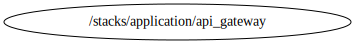

<!-- BEGIN_TF_DOCS -->

# Stack for deploying Api Gateway resources
Below is information on the modules and resources
## Modules info
- [terraform-aws-api-gateway](../../../modules/terraform-aws-api-gateway): N/A
- [terraform-aws-modules/cloudwatch/aws//modules/log-group](https://github.com/terraform-aws-modules/terraform-aws-cloudwatch): Version 4.3.0
- [cloudposse/waf/aws](https://github.com/cloudposse/terraform-aws-waf): Version 1.3.0

## Code Dependencies Graph
<center>

   

  ##### **Dependency Graph**

</center>

---

## Example parameter options for each environment

```hcl

 locals {
  env = {
    default = {
      #############################################################################
      # Commons Parameters
      #############################################################################
      tags = {
        Environment = terraform.workspace
        Protected   = false
        Layer       = "Application"
      }
      #############################################################################
      # api_gateway Module
      #############################################################################
      create_api        = false
      api_name          = "${var.prefix}-${terraform.workspace}-niif-api-gtw"
      create_api_domain = false
      openapi_config    = null
      definition_path   = "${path.module}/datafiles/oas_dev.json"

      api_endpoint_type        = "REGIONAL"
      private_link_target_arns = []
      stage_name               = "${terraform.workspace}"
      policy_statements        = {}

      api_logging_level        = "INFO"
      api_metrics_enabled      = true
      api_xray_tracing_enabled = true

      lambda_integrations = {}

      api_domain_name = ""
      #############################################################################      
      # wafv2_log_group Module
      #############################################################################
      create_waf_log            = false
      waf_log_name              = "aws-waf-logs-${var.prefix}-${terraform.workspace}-api"
      waf_log_kms_key_id        = null //var.kms_key_id
      waf_log_retention_in_days = 30
      #############################################################################
      # api_wafv2 Module
      #############################################################################
      create_waf         = false
      waf_name           = "${var.prefix}-${terraform.workspace}-niif-apigateway-waf"
      waf_scope          = "REGIONAL"
      waf_default_action = "allow"
      waf_visibility_config = {
        cloudwatch_metrics_enabled = true
        metric_name                = "${var.prefix}-${terraform.workspace}-webaclapigateway"
        sampled_requests_enabled   = true
      }
      waf_managed_rule_group_statement_rules = [
        {
          name            = "${var.prefix}-rule-${lower("AWSManagedRulesCommonRuleSet")}-${terraform.workspace}"
          override_action = "none"
          priority        = 20

          statement = {
            name        = "AWSManagedRulesCommonRuleSet"
            vendor_name = "AWS"
            rule_action_override = {
              SizeRestrictions_BODY = {
                action = "count"
              }
            }
          }

          visibility_config = {
            cloudwatch_metrics_enabled = true
            sampled_requests_enabled   = true
            metric_name                = "${var.prefix}-metric-${lower("AWSManagedRulesCommonRuleSet")}-${terraform.workspace}"
          }
        },
        {
          name            = "${var.prefix}-rule-${lower("AWSManagedRulesSQLiRuleSet")}-${terraform.workspace}"
          override_action = "none"
          priority        = 30

          statement = {
            name        = "AWSManagedRulesSQLiRuleSet"
            vendor_name = "AWS"
          }

          visibility_config = {
            cloudwatch_metrics_enabled = true
            sampled_requests_enabled   = true
            metric_name                = "${var.prefix}-metric-${lower("AWSManagedRulesSQLiRuleSet")}-${terraform.workspace}"
          }
        },
        {
          name            = "${var.prefix}-rule-${lower("AWSManagedRulesAmazonIpReputationList")}-${terraform.workspace}"
          override_action = "none"
          priority        = 40

          statement = {
            name        = "AWSManagedRulesAmazonIpReputationList"
            vendor_name = "AWS"
          }

          visibility_config = {
            cloudwatch_metrics_enabled = true
            sampled_requests_enabled   = true
            metric_name                = "${var.prefix}-metric-${lower("AWSManagedRulesAmazonIpReputationList")}-${terraform.workspace}"
          }
        },
        {
          name            = "${var.prefix}-rule-${lower("AWSManagedRulesAnonymousIpList")}-${terraform.workspace}"
          override_action = "none"
          priority        = 50

          statement = {
            name        = "AWSManagedRulesAnonymousIpList"
            vendor_name = "AWS"
          }

          visibility_config = {
            cloudwatch_metrics_enabled = true
            sampled_requests_enabled   = true
            metric_name                = "${var.prefix}-metric-${lower("AWSManagedRulesAnonymousIpList")}-${terraform.workspace}"
          }
        },
      ]
      size_constraint_statement_rules = [
        {
          name     = "${var.prefix}-rule-${lower("sizeconstraintstatement")}-${terraform.workspace}"
          action   = "block"
          priority = 10

          statement = {
            comparison_operator = "GT"
            size                = 1000000

            field_to_match = {
              all_query_arguments = {}
            }

            text_transformation = [
              {
                type     = "COMPRESS_WHITE_SPACE"
                priority = 1
              }
            ]
          }

          visibility_config = {
            cloudwatch_metrics_enabled = true
            sampled_requests_enabled   = true
            metric_name                = "${var.prefix}-metric-${lower("sizeconstraintstatement")}-${terraform.workspace}"
          }
        }
      ]
      api_waf_association_resource_arns = null
    }
    dev = {
      create_api     = true
      create_waf     = true
      create_waf_log = true
    }
    qa = {
      create_api     = true
      create_waf     = true
      create_waf_log = true

      definition_path = "${path.module}/datafiles/oas_qa.json"

      lambda_integrations = {
        post_login = {
          name         = "niif-post-login"
          api_resource = "/*/GET/post_login"
          statement_id = "post_login"
        }
        certify = {
          name         = "niif-cerfication"
          api_resource = "/*/POST/certify"
          statement_id = "certify"
        }
        not_certify = {
          name         = "niif-cerfication"
          api_resource = "/*/POST/not_certify"
          statement_id = "not_certify"
        }
      }
    }
    prd = {
      create_api     = true
      create_waf     = true
      create_waf_log = true

      definition_path = "${path.module}/datafiles/oas_prd.json"
    }
  }
  # Set workspace parameters for the associated environment
  environment_vars = contains(keys(local.env), terraform.workspace) ? terraform.workspace : "default"
  workspace        = merge(local.env["default"], local.env[local.environment_vars])
}

```
## Requirements

No requirements.

## Providers

| Name | Version |
|------|---------|
| <a name="provider_aws"></a> [aws](#provider\_aws) | 5.15.0 |
| <a name="provider_template"></a> [template](#provider\_template) | 2.2.0 |

## Modules

| Name | Source | Version |
|------|--------|---------|
| <a name="module_api_gtw"></a> [api\_gtw](#module\_api\_gtw) | ../../../modules/terraform-aws-api-gateway | n/a |
| <a name="module_api_wafv2"></a> [api\_wafv2](#module\_api\_wafv2) | cloudposse/waf/aws | 1.3.0 |
| <a name="module_wafv2_log_group"></a> [wafv2\_log\_group](#module\_wafv2\_log\_group) | terraform-aws-modules/cloudwatch/aws//modules/log-group | 4.3.0 |

## Resources

| Name | Type |
|------|------|
| [aws_caller_identity.current](https://registry.terraform.io/providers/hashicorp/aws/latest/docs/data-sources/caller_identity) | data source |
| [aws_region.current](https://registry.terraform.io/providers/hashicorp/aws/latest/docs/data-sources/region) | data source |
| [template_file.oas_definition](https://registry.terraform.io/providers/hashicorp/template/latest/docs/data-sources/file) | data source |

## Inputs

| Name | Description | Type | Default | Required |
|------|-------------|------|---------|:--------:|
| <a name="input_aws_access_key"></a> [aws\_access\_key](#input\_aws\_access\_key) | Variable for AWS Access Key | `string` | `null` | no |
| <a name="input_aws_secret_key"></a> [aws\_secret\_key](#input\_aws\_secret\_key) | Variable for AWS Secret Key | `string` | `null` | no |
| <a name="input_aws_token"></a> [aws\_token](#input\_aws\_token) | Variable for AWS Token | `string` | `null` | no |
| <a name="input_prefix"></a> [prefix](#input\_prefix) | Prefix for naming resources | `string` | n/a | yes |
| <a name="input_profile"></a> [profile](#input\_profile) | Variable for credentials management. | `map(map(string))` | n/a | yes |
| <a name="input_project"></a> [project](#input\_project) | Project name | `string` | n/a | yes |
| <a name="input_required_tags"></a> [required\_tags](#input\_required\_tags) | A map of tags to add to all resources | `map(string)` | n/a | yes |

## Outputs

No outputs.

<!-- END_TF_DOCS -->