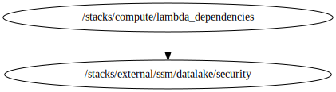

<!-- BEGIN_TF_DOCS -->

# Module for Compute deployment

Terraform stack to provision compute elements using the next Terraform modules and resources:

## Modules & Resources
### Module - lambda
**Source Module info:**
- **Version** : "6.0.1"
- **Link**    : [terraform-aws-modules/lambda/aws](github.com/terraform-aws-modules/terraform-aws-lambda)

## Code Dependencies Graph
<center>

   

  ##### **Dependency Graph**

</center>

---

## Example parameter options for each environment

```hcl

 locals {
  env = {
    default = {
      #############################################################################
      # Common Parameters
      #############################################################################
      enabled_parameters = false
      tags = {
        Environment = terraform.workspace
        Layer       = "Compute"
      }
      #############################################################################
      # lambda_versions Module
      #############################################################################
      lambda_versions = {
        notification = {
          create      = true
          name        = "/${var.prefix}/${terraform.workspace}/niif/lambda/version/notification"
          description = "Parameters of the lambda Notification version"
        }
        post_login = {
          create      = true
          name        = "/${var.prefix}/${terraform.workspace}/niif/lambda/version/post-login"
          description = "Parameters of the lambda Post Login version"
        }
        certification = {
          create      = true
          name        = "/${var.prefix}/${terraform.workspace}/niif/lambda/version/certification"
          description = "Parameters of the lambda Certification version"
        }
      }
      #############################################################################
      # lambda_ecr Module
      #############################################################################
      lambda_ecr = {
        notification = {
          create          = true
          repository_name = "${var.prefix}_${terraform.workspace}_niif_notification"
        }
        post_login = {
          create          = true
          repository_name = "${var.prefix}_${terraform.workspace}_niif_post_login"
        }
        certification = {
          create          = true
          repository_name = "${var.prefix}_${terraform.workspace}_niif_certification"
        }
      }
      image_tag_mutability          = "MUTABLE"
      repository_encryption_type    = "KMS"
      repository_kms_key            = var.storage_key_arn
      repository_force_delete       = true
      repository_image_scan_on_push = true
      create_lifecycle_policy       = true
      repository_lifecycle_policy = jsonencode({
        rules = [
          {
            rulePriority = 1,
            description  = "Delete untagged images",
            selection = {
              tagStatus   = "untagged",
              countType   = "sinceImagePushed",
              countUnit   = "days"
              countNumber = 1
            },
            action = {
              type = "expire"
            }
          },
          {
            rulePriority = 2,
            description  = "Keep last 10 images",
            selection = {
              tagStatus     = "tagged",
              tagPrefixList = ["v", "20"]
              countType     = "imageCountMoreThan",
              countNumber   = 10
            },
            action = {
              type = "expire"
            }
          }
        ]
      })
      repository_lambda_read_access_arns = [
        "arn:aws:lambda:${data.aws_region.current.name}:${data.aws_caller_identity.current.account_id}:function:*"
      ]
    }
    dev = {

    }
    qa = {

    }
    prd = {

    }
  }
  # Set workspace parameters for the associated environment
  environment_vars = contains(keys(local.env), terraform.workspace) ? terraform.workspace : "default"
  workspace        = merge(local.env["default"], local.env[local.environment_vars])
}

```
## Requirements

No requirements.

## Providers

| Name | Version |
|------|---------|
| <a name="provider_aws"></a> [aws](#provider\_aws) | 5.96.0 |

## Modules

| Name | Source | Version |
|------|--------|---------|
| <a name="module_lambda_ecr"></a> [lambda\_ecr](#module\_lambda\_ecr) | terraform-aws-modules/ecr/aws | 1.6.0 |
| <a name="module_ssm_ps_lambda_versions"></a> [ssm\_ps\_lambda\_versions](#module\_ssm\_ps\_lambda\_versions) | terraform-aws-modules/ssm-parameter/aws | 1.1.0 |

## Resources

| Name | Type |
|------|------|
| [aws_caller_identity.current](https://registry.terraform.io/providers/hashicorp/aws/latest/docs/data-sources/caller_identity) | data source |
| [aws_region.current](https://registry.terraform.io/providers/hashicorp/aws/latest/docs/data-sources/region) | data source |

## Inputs

| Name | Description | Type | Default | Required |
|------|-------------|------|---------|:--------:|
| <a name="input_storage_key_arn"></a> [storage\_key\_arn](#input\_storage\_key\_arn) | The ARN for the KMS encryption key | `string` | n/a | yes |

## Outputs

| Name | Description |
|------|-------------|
| <a name="output_lambda_ecr_urls"></a> [lambda\_ecr\_urls](#output\_lambda\_ecr\_urls) | Map with the ECR repository URLs |
| <a name="output_lambda_version_ssm_names"></a> [lambda\_version\_ssm\_names](#output\_lambda\_version\_ssm\_names) | Map with the parameter store ids that store the lambda versions |

<!-- END_TF_DOCS -->