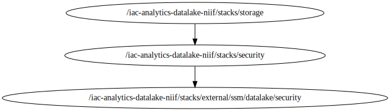

<!-- BEGIN_TF_DOCS -->

# Module for Application resources deployment

Terraform stack to provision a custom ECS Service and Task Cluster using the following Terraform modules and resources:

## Modules & Resources
### Module - storage\_bucket
**Source Module info:**
- **Version** : "3.15.0"
- **Link**    : [terraform-aws-modules/s3-bucket/aws](github.com/terraform-aws-modules/terraform-aws-s3-bucket)

## Code Dependencies Graph
<center>

   

  ##### **Dependency Graph**

</center>

---

## Example parameter options for each environment

```hcl

 locals {
  env = {
    default = {
      #############################################################################
      # Commons Parameters
      #############################################################################
      tags = {
        Environment = terraform.workspace
        Protected   = false
        Layer       = "Storage"
      }
      #############################################################################
      # cert_bucket Module
      #############################################################################
      create_cert_bucket              = false
      cert_bucket_name                = "alfa-${var.prefix}-${terraform.workspace}-niif-certification"
      cert_bucket_force_destroy       = true
      cert_bucket_object_lock_enabled = false
      cert_bucket_lifecycle_rule      = []
      cert_bucket_versioning = {
        status     = true
        mfa_delete = false
      }
      cert_bucket_attach_policy = false
      cert_bucket_policy        = null

      cert_bucket_sse_configuration = {
        rule = {
          apply_server_side_encryption_by_default = {
            kms_master_key_id = var.storage_kms_key_arn
            sse_algorithm     = "aws:kms"
          }
        }
      }
    }
    dev = {
      create_cert_bucket = true
    }
    qa = {
      create_cert_bucket = true
    }
    prd = {
      create_cert_bucket = true
    }
  }
  # Set workspace parameters for the associated environment
  environment_vars = contains(keys(local.env), terraform.workspace) ? terraform.workspace : "default"
  workspace        = merge(local.env["default"], local.env[local.environment_vars])
}

```
## Requirements

No requirements.

## Providers

| Name | Version |
|------|---------|
| <a name="provider_aws"></a> [aws](#provider\_aws) | 5.96.0 |

## Modules

| Name | Source | Version |
|------|--------|---------|
| <a name="module_cert_bucket"></a> [cert\_bucket](#module\_cert\_bucket) | terraform-aws-modules/s3-bucket/aws | 3.15.0 |

## Resources

| Name | Type |
|------|------|
| [aws_caller_identity.current](https://registry.terraform.io/providers/hashicorp/aws/latest/docs/data-sources/caller_identity) | data source |
| [aws_iam_policy_document.bucket_policy](https://registry.terraform.io/providers/hashicorp/aws/latest/docs/data-sources/iam_policy_document) | data source |
| [aws_region.current](https://registry.terraform.io/providers/hashicorp/aws/latest/docs/data-sources/region) | data source |

## Inputs

| Name | Description | Type | Default | Required |
|------|-------------|------|---------|:--------:|
| <a name="input_storage_kms_key_arn"></a> [storage\_kms\_key\_arn](#input\_storage\_kms\_key\_arn) | The ARN for the KMS encryption key | `string` | n/a | yes |

## Outputs

| Name | Description |
|------|-------------|
| <a name="output_cert_bucket_arn"></a> [cert\_bucket\_arn](#output\_cert\_bucket\_arn) | The ARN of the bucket. Will be of format arn:aws:s3:::bucketname. |
| <a name="output_cert_bucket_id"></a> [cert\_bucket\_id](#output\_cert\_bucket\_id) | The name of the bucket. |

<!-- END_TF_DOCS -->